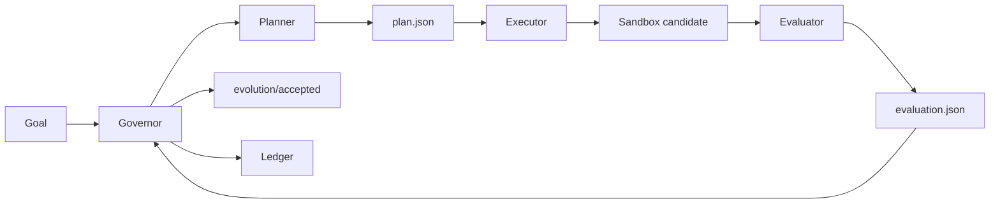

# Evolution Kernel

<p align="center">
  <strong>A general-purpose evolution engine for autonomously improving software projects.</strong>
</p>

<p align="center">
  <a href="README.zh.md">中文</a>
  ·
  <a href="docs/protocol.md">Protocol</a>
  ·
  <a href="docs/token-ignition-first-task.md">First Target</a>
</p>

<p align="center">
  
  = 3.10">
  
  
</p>

**Evolution Kernel** is a minimal protocol and runtime for autonomous, self-evolving software systems.

It is not a project-specific automation script. Its purpose is to make software evolution **controlled, reproducible, sandboxed, auditable, and reversible**. Any project can become an optimization target once it can expose a goal, a sandbox, and an evaluator.

## Why It Exists

Modern coding agents can propose and modify code, but long-running software improvement needs more than code generation. It needs a kernel that can:

- define what improvement means for a target project,
- isolate each experiment before it touches the accepted branch,
- evaluate candidate changes with repeatable criteria,
- promote only accepted candidates,
- keep a ledger of what happened and why.

Evolution Kernel provides that loop as a small, inspectable runtime.

## Evolution Loop



## First Optimization Target

Evolution Kernel is designed to optimize **any** software project. The first project being optimized is **Token-Ignition**, specifically its backend evaluator.

Token-Ignition is therefore the first optimization target and reference adapter, not a hard dependency. It is used to prove that the kernel can safely and deterministically evolve a real codebase while keeping the runtime small.

## Current Status

The current v0 implementation provides the foundational runtime:

| Area | What exists now |
| --- | --- |
| Governor | Deterministic orchestration for planning, execution, evaluation, promotion, rollback, and ledger updates. |
| Sandbox | Git worktree-based experiment isolation. Candidate changes do not affect the accepted branch unless promoted. |
| Role handoff | `planner`, `executor`, and `evaluator` run as isolated commands and communicate through JSON files. |
| Promotion model | Accepted candidates advance the local `evolution/accepted` branch. Rejected experiments remain recorded but do not advance it. |
| First adapter | A Token-Ignition adapter with a hand-written golden set for evaluator evolution. |

## What It Does Not Do Yet

| Not yet | Why it matters |
| --- | --- |
| LLM-native planner/executor | The current tests use fixture scripts; real agent integrations are the next step. |
| Strong process/container sandboxing | Git worktrees isolate files, but executor and evaluator isolation should become stronger. |
| Multi-target adapter framework | Token-Ignition is the first target; more adapters are needed to prove generality. |
| Parallel evolution branches | v0 focuses on one accepted branch and a simple promotion path. |

## Roadmap

- [ ] Add LLM-driven planner and executor implementations.
- [ ] Add stronger sandbox isolation for executor and evaluator runs.
- [ ] Generalize the adapter interface beyond Token-Ignition.
- [ ] Add examples for multiple project types.
- [ ] Support parallel evolution branches and richer merge strategies.
- [ ] Improve reporting around ledger history, promotion decisions, and rejected candidates.

## Documents

- [Protocol](docs/protocol.md)
- [Token-Ignition First Task](docs/token-ignition-first-task.md)

## Run Tests

```bash
python3 -m unittest discover -s tests -v
python3 adapters/token_ignition/evaluate_golden_cases.py
```

## CLI Shape

```bash
python3 -m evolution_kernel.cli \
  --repo /path/to/target-repo \
  --ledger /path/to/evolution-ledger \
  --goal /path/to/goal.json \
  --planner python3 /path/to/planner.py \
  --executor python3 /path/to/executor.py \
  --evaluator python3 /path/to/evaluator.py
```

Each role command receives:

```text
--input <json>
--output <json>
--worktree <sandbox path>
```
