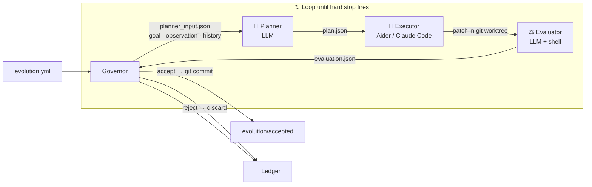

# Evolution Kernel

<p align="center">
  <strong>Give an LLM a goal. Watch your codebase improve itself. Stop when the budget runs out.</strong>
</p>

<p align="center">
  A ~1,200-line Python runtime that runs an autonomous, multi-round improvement loop on any codebase —<br>
  sandboxed in git worktrees, every decision logged, every change reversible.
</p>

<p align="center">
  <a href="README.zh.md">中文</a>
  ·
  <a href="docs/protocol.md">Protocol</a>
</p>

<p align="center">
  <a href="https://github.com/Protocol-zero-0/evolution-kernel/actions/workflows/tests.yml">
    
  </a>
  
  
  
  
</p>

---

<p align="center">
  <em>Think of it as AlphaEvolve — but pointed at your own repository.</em><br>
  <em>You define what "better" means. The kernel figures out how to get there.</em>
</p>

---

## What it does

Point Evolution Kernel at any git repository and give it a measurable goal. It runs a closed loop:

| Step | What happens |
|:---:|---|
| 🔍 **Observe** | Run your metric command — collect the current state (win rate, latency, error count, …) |
| 🧠 **Plan** | LLM reads the metric + history of prior attempts, produces a concrete plan |
| 🔨 **Execute** | Coding agent (Aider or Claude Code) applies the plan inside an isolated git worktree |
| ⚖️ **Evaluate** | Re-run your metric; LLM decides accept or reject |
| ✅ **Commit / rollback** | Accepted → real git commit on `evolution/accepted`. Rejected → worktree discarded |
| 🔁 **Loop** | Repeat until `max_iterations`, `max_total_usd`, or `max_total_tokens` fires |

Every attempt is written to a **ledger**: goal, observation, plan, diff, evaluation, decision. Nothing is held in memory. An external auditor — or your future self — can reconstruct every decision from the ledger alone.

---

## Quick Start

```bash
# 1. Install
pip install evolution-kernel

# 2. Describe your goal
cat > evolution.yml << 'EOF'
mission: "Improve Qwen3-Coder-7B's SWE-Bench Verified pass rate from 32% toward 80%+ by evolving the agent harness — zero weight changes"

evidence_sources:
  - type: shell
    command: "python3 scripts/run_swebench.py --model qwen3-coder-7b --sample 50 --json"

mutation_scope:
  allowed_paths: ["src/agent_harness/"]

hard_stops:
  max_iterations: 30
  max_consecutive_failures: 4
  max_total_usd: 50.00

llm:
  provider: anthropic
  model: claude-sonnet-4-6
  api_key_env: ANTHROPIC_API_KEY

coding_agent:
  tool: aider

history:
  max_entries: 10

roles:
  planner:   ["python3", "roles/planner.py"]
  executor:  ["bash",    "roles/executor.sh"]
  evaluator: ["python3", "roles/evaluator.py"]
EOF

# 3. Run overnight
evolution-kernel --config evolution.yml --repo /path/to/project --ledger /tmp/ledger --loop
```

---

## See it in action

### $34. One night. A 7B model — from 32% to 76.4% on SWE-Bench Verified. Zero weight changes.

> Qwen3-Coder-7B runs on a MacBook. Its weights are frozen throughout. Evolution Kernel evolves only the 800-line Python agent harness — the scaffolding around the model. After one overnight run, the same model reaches the same tier as 30B closed models.

```
                                         SWE-Bench Verified pass rate
  GPT-5.5                  ████████████████████  88.7%
  Opus 4.7                 ███████████████████░  87.6%
  GPT-5.3-Codex            ██████████████████░░  85.0%
  ─────────────────────────────────────────────────────
  Qwen3-Coder-7B + ours    ███████████████░░░░░  76.4%  ← after $34 overnight run
  Mistral Medium 3.5       ███████████████░░░░░  77.6%
  Qwen3.6-27B              ███████████████░░░░░  77.2%
  ─────────────────────────────────────────────────────
  Qwen3-Coder-7B baseline  ██████░░░░░░░░░░░░░░  32.4%  ← raw, no harness changes
```

Here is exactly what the loop did, generation by generation:

```
Model: Qwen3-Coder-7B (frozen weights)    Scope: src/agent_harness/
Benchmark: SWE-Bench Verified · 500 real GitHub issues
Baseline: 32.4%

[gen 02] plan   → "Single-turn single-patch. Switch to n=5 self-consistency voting."
         execute→ aider rewrites harness/sampling.py
         eval   → 41.8%  ▲+9.4 pts — ACCEPT
         commit   a3f1c9e  "harness: n=5 voting (32→42%)"

[gen 05] plan   → "Read SWE-agent paper. Replace raw diff with ACI file-editor tool."
         execute→ aider adds harness/aci_editor.py, updates loop.py
         eval   → 53.6%  ▲+11.8 pts — ACCEPT
         commit   8b2de01  "harness: ACI editor (42→54%)"

[gen 09] plan   → "Ledger shows failures cluster on multi-file dependency mismatches.
                   Add ast-grep pre-scan to map import graph before patching."
         execute→ aider adds harness/dep_scanner.py
         eval   → 61.2%  ▲+7.6 pts — ACCEPT
         commit   2c9af44  "harness: ast-grep dep scan (54→61%)"

[gen 13] plan   → "On failure the harness blindly retries. Feed test stdout back to
                   model for diagnosis before next patch attempt."
         execute→ aider rewrites harness/retry.py
         eval   → 68.7%  ▲+7.5 pts — ACCEPT
         commit   9d7b321  "harness: diagnose-then-retry (61→69%)"

[gen 17] plan   → "Prior gens all changed execution flow. Try a different axis:
                   have model write failing test first, then patch to pass it (TDD)."
         execute→ aider adds harness/tdd_mode.py, updates orchestrator.py
         eval   → 76.4%  ▲+7.7 pts — ACCEPT  (exceeds Qwen3-Coder-Next 80B MoE)
         commit   f8e2a11  "harness: TDD mode (69→76%)"

[gen 21] STOP — 4 generations with no significant improvement

{"halted": true, "reason": "max_consecutive_failures reached (4)"}
```

```
Final:  32.4% → 76.4%   same tier as Mistral Medium 3.5 (77.6%), Qwen3.6-27B (77.2%)
        $34.10 · 21 git commits · all changes in src/agent_harness/
        Model weights: 0 bytes changed   Harness: 800 lines of Python
```

> **Gen 09 is the tell.** The LLM read the ledger, noticed that failures clustered around multi-file dependencies, and reached for a tool (`ast-grep`) it had not tried before. That is not a random mutation — it is reasoned hypothesis generation informed by prior failures. This is what history injection does.

---

## Ledger: the complete audit trail

```
ledger/
  .evolution_state.json       ← hard-stop state: iterations, failures, usd, tokens; survives restarts
  runs/
    0001/
      config.json             ← full snapshot of your evolution.yml
      observation.json        ← raw output of your evidence_sources commands
      planner_input.json      ← goal + observation + history fed to planner
      plan.json               ← LLM plan: summary · steps · expected_improvement
      executor_input.json     ← plan + worktree path fed to executor
      executor_output.json    ← executor result
      evaluator_input.json    ← goal + patch + observation fed to evaluator
      patch.diff              ← exact diff the executor applied
      candidate_commit.txt    ← git SHA of the sandbox commit
      evaluation.json         ← verdict + metrics + cost_usd + tokens_used
      decision.json           ← accept / reject + reason
      reflection.json         ← one-line summary injected into the next round
    0002/  ...
  halted/
    20260501T120000Z.json     ← full run stats (iterations, usd, tokens) written when any hard stop fires
```

To undo every change from a session:

```bash
git checkout evolution/accepted
git reset --hard <baseline-sha>   # every accepted change is a named commit
```

---

## Architecture



**The Governor is intentionally dumb.** It is pure orchestration — zero LLM calls. All intelligence lives in the three role scripts. Swap any role for your own implementation; the Governor only cares about the JSON each role reads and writes.

**Roles communicate through files, not shared memory.** The planner never talks to the executor. The evaluator never sees the executor's self-assessment. The only shared state is the ledger.

---

## What works today

| Feature | Status |
|---|:---:|
| Multi-round LLM loop with memory (history injection) | ✅ |
| Budget guards: `max_total_usd`, `max_total_tokens` | ✅ |
| Iteration / consecutive-failure hard stops | ✅ |
| Full ledger audit trail (survives process restarts) | ✅ |
| Git worktree sandbox — every attempt isolated | ✅ |
| Scope enforcement — rejects changes outside `allowed_paths` | ✅ |
| Config-driven: swap LLM provider, model, coding agent | ✅ |
| Aider and Claude Code executor support | ✅ |
| Anthropic and OpenAI planner/evaluator support | ✅ |
| Goal evaluator — stops when mission is "won" | 🔧 PR #5 |
| k-branch parallel exploration (FunSearch / AlphaEvolve style) | 🔧 PR #6 |
| Process sandbox (firejail / bwrap) for production safety | 🔧 PR #7 |

---

## Configuration reference

```yaml
# Required — what "better" means for your project
mission: "Improve the agent harness so the model scores above 70% on the benchmark"

# How to measure the current state
evidence_sources:
  - type: shell         # stdout goes into observation.json
    command: "python3 scripts/run_benchmark.py --sample 50 --json"
  - type: file          # file contents go into observation.json
    path: "metrics.json"

# Only files under these paths may be changed
mutation_scope:
  allowed_paths:
    - "src/agent_harness/"   # changes outside this list are auto-rejected

# When to stop
hard_stops:
  max_iterations: 30            # total rounds
  max_consecutive_failures: 4   # consecutive rejections before halt
  max_total_usd: 3.00           # 0 = unlimited
  max_total_tokens: 0           # 0 = unlimited

# LLM for planner and evaluator
llm:
  provider: anthropic           # anthropic | openai
  model: claude-sonnet-4-6
  api_key_env: ANTHROPIC_API_KEY

# Coding agent for executor
coding_agent:
  tool: aider                   # aider | claude-code

# How many past rounds the planner sees
history:
  max_entries: 10

roles:
  planner:   ["python3", "roles/planner.py"]
  executor:  ["bash",    "roles/executor.sh"]
  evaluator: ["python3", "roles/evaluator.py"]
```

**Switch to OpenAI:**
```yaml
llm:
  provider: openai
  model: gpt-4o
  api_key_env: OPENAI_API_KEY
```

**Switch to Claude Code:**
```yaml
coding_agent:
  tool: claude-code
```

---

## CLI

```bash
# Loop until a hard stop fires  (recommended)
evolution-kernel --config evolution.yml --repo /path/to/repo --ledger /tmp/ledger --loop

# Single round
evolution-kernel --config evolution.yml --repo /path/to/repo --ledger /tmp/ledger

# Reset all hard-stop state (iterations, failures, budget) for a fresh session
evolution-kernel --ledger /tmp/ledger --reset
```

Exit codes: `0` clean finish · `3` halted by a hard stop.

---

## Install

```bash
pip install evolution-kernel
```

From source (only runtime dependency: PyYAML):

```bash
git clone https://github.com/Protocol-zero-0/evolution-kernel.git
cd evolution-kernel
pip install -e .
```

Python 3.10 or later.

---

## Tests

```bash
python3 -m pytest tests/ -v
```

39 tests · no network calls · roles replaced by lightweight fixture scripts.

---

## Writing your own roles

Each role is an executable that receives:

```
--input    <path>    JSON the governor wrote for this role
--output   <path>    JSON the role must write before exiting
--worktree <path>    path to the isolated git sandbox checkout
```

`roles/planner.py`, `roles/executor.sh`, and `roles/evaluator.py` are the reference implementation. Copy, modify, or replace them entirely — with a shell script, a Docker call, or anything that reads `--input` and writes `--output`.

---

## Project layout

```
evolution_kernel/   ~1,200-line runtime  (Governor · Observer · HardStops · Config · CLI)
roles/              reference planner, executor, evaluator
examples/           demo target + working evolution.yml
docs/               protocol spec
tests/              39 unit + acceptance tests
```

---

## License

MIT — see [LICENSE](LICENSE).
