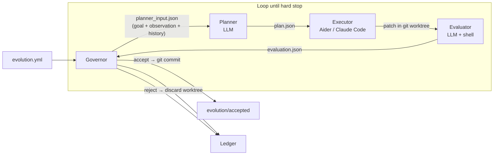

# Evolution Kernel

<p align="center">
  <strong>Give an LLM a goal. Watch your repo improve itself. Stop when the budget runs out.</strong>
</p>

<p align="center">
  <em>A ~1,200-line Python runtime for autonomous, multi-round code improvement — sandboxed, audited, and fully reversible.</em>
</p>

<p align="center">
  <a href="README.zh.md">中文</a>
  ·
  <a href="docs/protocol.md">Protocol</a>
</p>

<p align="center">
  <a href="https://github.com/Protocol-zero-0/evolution-kernel/actions/workflows/tests.yml">
    
  </a>
  
  = 3.10">
  
  
</p>

---

## What it does

Write a YAML file that says what "better" means. Evolution Kernel runs a tight loop:

1. **Observe** — collect the current metric (coverage %, benchmark score, lint count — whatever your shell command outputs)
2. **Plan** — an LLM reads the metric and the history of prior attempts, then writes a concrete plan
3. **Execute** — a coding agent (Aider or Claude Code) applies the plan inside a git worktree sandbox
4. **Evaluate** — the evaluator re-runs your metric command and decides accept or reject
5. **Commit or roll back** — accepted changes become a real git commit; rejected ones are discarded
6. **Loop** — repeat until a budget limit fires (`max_iterations`, `max_total_usd`, `max_total_tokens`)

Every attempt — accepted or rejected — is written to a structured **ledger** so you can audit exactly what the LLM tried, what changed, and why each round was accepted or rejected.

---

## Quick Start

```bash
# 1. Install (single runtime dependency: PyYAML)
pip install evolution-kernel

# 2. Write a goal config
cat > evolution.yml << 'EOF'
mission: "Increase src/ test coverage from 40% to 80%"

evidence_sources:
  - type: shell
    command: >
      python3 -m pytest --cov=src --cov-report=json -q &&
      python3 -c "import json; d=json.load(open('coverage.json'));
                  print(f'coverage: {d[\"totals\"][\"percent_covered\"]:.1f}%')"

mutation_scope:
  allowed_paths: ["tests/"]

hard_stops:
  max_iterations: 20
  max_consecutive_failures: 3
  max_total_usd: 2.00

llm:
  provider: anthropic
  model: claude-sonnet-4-6
  api_key_env: ANTHROPIC_API_KEY

coding_agent:
  tool: aider

roles:
  planner:   ["python3", "roles/planner.py"]
  executor:  ["bash",    "roles/executor.sh"]
  evaluator: ["python3", "roles/evaluator.py"]
EOF

# 3. Run until the budget fires
evolution-kernel --config evolution.yml --repo /path/to/your-project --ledger /tmp/ledger --loop
```

---

## Example: raising test coverage from 40% to 80%

The loop emits one JSON object per round. A realistic session looks like this:

```
Round 1  observe: coverage 40.2%
  plan    → "Add unit tests for src/parser.py — parse_tokens is completely uncovered"
  execute → aider writes tests/test_parser.py (14 new assertions)
  eval    → coverage 51.7% — ACCEPT
  commit  → a3f1c9e  "tests: cover parse_tokens (coverage 40→52%)"

Round 2  observe: coverage 51.7%
  plan    → "Add edge-case tests for src/validator.py, missing branch coverage on error paths"
  execute → aider extends tests/test_validator.py (+9 tests)
  eval    → coverage 63.4% — ACCEPT
  commit  → 8b2de01  "tests: validator edge cases (coverage 52→63%)"

Round 3  observe: coverage 63.4%
  plan    → "Cover src/formatter.py — currently 0% covered"
  execute → aider writes tests/test_formatter.py
  eval    → coverage 63.4% — new test file has wrong import path — REJECT
  rollback → worktree discarded, main branch unchanged  (consecutive_failures: 1)

Round 4  observe: coverage 63.4%
  plan    → "tests/test_formatter.py failed due to import error; fix path and retry"
  execute → aider fixes import in tests/test_formatter.py
  eval    → coverage 74.8% — ACCEPT
  commit  → 2c9af44  "tests: formatter coverage, fixed import (coverage 63→75%)"

...

Round 12  observe: coverage 80.1%
  eval    → coverage 80.1% — threshold reached — ACCEPT
  commit  → 9d7b321  "tests: final push past 80% target"

{"halted": true, "reason": "max_iterations reached", "iterations": 20, "total_usd": 1.43, "total_tokens": 487201}
```

Each accepted change is a reversible git commit on the `evolution/accepted` branch. The LLM self-corrected on Round 4 using the rejection history from Round 3 — this is what history injection does.

---

## Ledger structure

Every round writes a full evidence trail. Nothing is stored in memory; an external auditor can reconstruct every decision from the ledger directory alone.

```
ledger/
  .evolution_state.json       # persisted counters (iterations, usd, tokens) — survives restarts
  runs/
    0001/
      config.json             # full snapshot of your evolution.yml
      observation.json        # raw output of your evidence_sources commands
      plan.json               # LLM plan: summary, steps, expected_improvement
      patch.diff              # exact diff the executor applied
      candidate_commit.txt    # git SHA of the sandbox commit
      evaluation.json         # verdict + metrics + cost_usd + tokens_used
      decision.json           # accept / reject + reason
      reflection.json         # one-line summary injected into the next round's history
    0002/
      ...
  halted/
    20260501T120000Z.json     # written when any hard stop fires
```

---

## Architecture



**The Governor is intentionally dumb.** It is pure orchestration — no LLM calls of its own. All intelligence lives in the three role scripts. You can swap any role for your own implementation; the Governor only cares about the JSON files roles read and write.

**Roles communicate through files, not shared memory.** The planner never talks directly to the executor. The evaluator never sees the executor's self-assessment. The only shared state is the ledger.

---

## Capabilities

| Feature | Status |
|---|---|
| Multi-round LLM loop with memory (history injection) | ✅ Working |
| Budget guards: `max_total_usd`, `max_total_tokens` | ✅ Working |
| Iteration / consecutive-failure hard stops | ✅ Working |
| Full ledger audit trail (survives process restarts) | ✅ Working |
| Git worktree sandbox — every attempt isolated | ✅ Working |
| Scope enforcement — rejects changes outside `allowed_paths` | ✅ Working |
| Config-driven: swap LLM provider, model, coding agent | ✅ Working |
| Aider and Claude Code executor support | ✅ Working |
| Anthropic and OpenAI planner/evaluator support | ✅ Working |
| Goal evaluator — stops when mission is "won" | 🔧 PR #5 |
| k-branch parallel exploration (FunSearch style) | 🔧 PR #6 |
| Process sandbox (firejail / bwrap) for production safety | 🔧 PR #7 |

---

## Configuration reference

```yaml
# Required — free-text statement of what "better" means
mission: "Increase src/ test coverage from 40% to 80%"

# How to measure the current state of the target repo
evidence_sources:
  - type: shell             # runs a command; stdout goes into observation.json
    command: "python3 -m pytest --cov=src -q && ..."
  - type: file              # reads a file; content goes into observation.json
    path: "metrics.json"

# Only files under these paths may be modified by the executor
mutation_scope:
  allowed_paths:
    - "tests/"              # changes outside this list are auto-rejected

# When to stop
hard_stops:
  max_iterations: 10            # total rounds (required, must be ≥ 1)
  max_consecutive_failures: 3   # consecutive rejections before halt (required)
  max_total_usd: 0.0            # 0 = unlimited
  max_total_tokens: 0           # 0 = unlimited

# LLM used by the planner and evaluator role scripts
llm:
  provider: anthropic           # anthropic | openai
  model: claude-sonnet-4-6
  api_key_env: ANTHROPIC_API_KEY

# Coding agent used by the executor role script
coding_agent:
  tool: aider                   # aider | claude-code

# How many past rounds the planner sees as context
history:
  max_entries: 10

# The three role commands (each receives --input, --output, --worktree)
roles:
  planner:   ["python3", "roles/planner.py"]
  executor:  ["bash",    "roles/executor.sh"]
  evaluator: ["python3", "roles/evaluator.py"]
```

**Switch to OpenAI:**

```yaml
llm:
  provider: openai
  model: gpt-4o
  api_key_env: OPENAI_API_KEY
```

**Switch to Claude Code as coding agent:**

```yaml
coding_agent:
  tool: claude-code
```

---

## CLI reference

```bash
# Run the multi-round loop (recommended — stops when a hard stop fires)
evolution-kernel --config evolution.yml --repo /path/to/repo --ledger /tmp/ledger --loop

# Run exactly one round
evolution-kernel --config evolution.yml --repo /path/to/repo --ledger /tmp/ledger

# Reset hard-stop counters to start a fresh session
evolution-kernel --ledger /tmp/ledger --reset
```

Exit codes: `0` = clean finish, `3` = halted by a hard stop.

---

## Install

```bash
pip install evolution-kernel
```

From source (the only runtime dependency is PyYAML):

```bash
git clone https://github.com/Protocol-zero-0/evolution-kernel.git
cd evolution-kernel
pip install -e .
```

Python 3.10 or later required.

---

## Running the tests

```bash
python3 -m pytest tests/ -v
```

All tests run locally with no network calls — roles are replaced by lightweight fixture scripts.

---

## Writing your own role scripts

Each role is an executable that receives three arguments:

```text
--input    <path>   JSON the governor prepared for this role
--output   <path>   JSON the role must write before exiting
--worktree <path>   path to the isolated git sandbox checkout
```

The built-in `roles/planner.py`, `roles/executor.sh`, and `roles/evaluator.py` are the reference implementation. Copy and modify them, or replace them entirely with a shell script, a Python program, or a Docker call. The Governor has no opinion on what runs inside a role.

---

## Rollback

Every accepted change is a commit on the `evolution/accepted` branch. To undo everything from a session:

```bash
git checkout evolution/accepted
git log --oneline              # find the baseline commit before the session
git reset --hard <baseline>    # roll back all accepted changes
```

Rejected experiments are never promoted, so only the changes your evaluator explicitly accepted survive.

---

## Project layout

```
evolution_kernel/   # ~1,200-line runtime (Governor, Observer, HardStops, Config, CLI)
roles/              # reference planner, executor, and evaluator implementations
examples/           # demo target + evolution.yml to run out of the box
docs/               # protocol spec
tests/              # unit + acceptance tests (39 tests, no network required)
```

---

## License

MIT. See [LICENSE](LICENSE).
