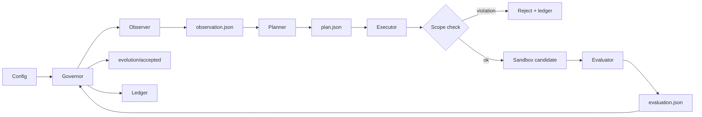

# Evolution Kernel

<p align="center">
  <strong>A general-purpose evolution engine for autonomously improving software projects.</strong>
</p>

<p align="center">
  <a href="README.zh.md">中文</a>
  ·
  <a href="docs/protocol.md">Protocol</a>
  ·
  <a href="docs/token-ignition-first-task.md">First Target</a>
</p>

<p align="center">
  
  = 3.10">
  
  
</p>

**Evolution Kernel** is a minimal protocol and runtime for autonomous, self-evolving software systems.

## Quick Start

```bash
# Install
pip install -e .

# Run the demo (uses fixture roles from tests/fixtures/)
bash examples/run_demo.sh

# Check the result
cat /tmp/ek-demo-ledger/runs/0001/decision.json
```

It is not a project-specific automation script. Its purpose is to make software evolution **controlled, reproducible, sandboxed, auditable, and reversible**. Any project can become an optimization target once it can expose a goal, a sandbox, and an evaluator.

## Why It Exists

Modern coding agents can propose and modify code, but long-running software improvement needs more than code generation. It needs a kernel that can:

- define what improvement means for a target project,
- isolate each experiment before it touches the accepted branch,
- evaluate candidate changes with repeatable criteria,
- promote only accepted candidates,
- keep a ledger of what happened and why.

Evolution Kernel provides that loop as a small, inspectable runtime.

## Evolution Loop



## First Optimization Target

Evolution Kernel is designed to optimize **any** software project. The first project being optimized is **Token-Ignition**, specifically its backend evaluator.

Token-Ignition is therefore the first optimization target and reference adapter, not a hard dependency. It is used to prove that the kernel can safely and deterministically evolve a real codebase while keeping the runtime small.

## Current Status

| Area | What exists now |
| --- | --- |
| Governor | Deterministic orchestration for planning, execution, evaluation, promotion, rollback, and ledger updates. |
| Sandbox | Git worktree-based experiment isolation. Candidate changes do not affect the accepted branch unless promoted. |
| Observer | Collects evidence from local files and shell commands before planning; writes `observation.json` into the ledger. |
| Mutation scope | `allowed_paths` enforces which files the executor may touch; violations are recorded as `scope_violation` without calling the evaluator. |
| Hard stops | `max_iterations` and `max_consecutive_failures` limits persist across runs in `ledger/state.json`; `--reset` clears them. |
| YAML config | `evolution.yml` unifies mission, evidence sources, mutation scope, hard stops, and role commands in one file. |
| Role handoff | `planner`, `executor`, and `evaluator` run as isolated commands and communicate through JSON files. |
| Promotion model | Accepted candidates advance the local `evolution/accepted` branch. Rejected experiments remain recorded but do not advance it. |

## Acceptance Checklist

Run the following scenarios to verify the kernel works end-to-end:

```bash
# 1. Full happy path (accept)
bash examples/run_demo.sh
cat /tmp/ek-demo-ledger/runs/0001/decision.json   # expect accepted: true

# 2. Evaluator rejects → decision recorded, no promotion
# Edit examples/run_demo.sh to use evaluator_reject.py, re-run, check:
cat /tmp/ek-demo-ledger/runs/0001/decision.json   # expect accepted: false

# 3. Observer writes evidence
cat /tmp/ek-demo-ledger/runs/0001/observation.json  # expect sources[] with results

# 4. Mutation scope violation → scope_violation, evaluator NOT called
# (see test_scope_violation_rejects_without_calling_evaluator in tests/test_governor.py)

# 5. Hard stop (max_consecutive_failures)
bash examples/run_demo_hard_stop.sh               # expect HardStopError after 2 failures

# 6. Reset hard stop state
python3 -m evolution_kernel.cli --reset --ledger /tmp/ek-demo-ledger
# Re-run → expect normal execution again
```

Or run the full unit test suite:

```bash
python3 -m unittest discover -s tests -v
```

## Current Limitations

| Limitation | Detail |
| --- | --- |
| No LLM-native roles | Planner/executor/evaluator are shell scripts or Python fixtures; real agent integrations are the next step. |
| File-only sandbox | Git worktrees isolate files; process/container-level isolation is not yet enforced. |
| Single evolution branch | v0 supports one `evolution/accepted` branch; parallel branches are not yet supported. |
| Scope check is path-prefix only | `allowed_paths` are matched by string prefix against `git status` output; glob or regex patterns are not supported. |

## Roadmap

- [ ] Add LLM-driven planner and executor implementations.
- [ ] Strengthen sandbox isolation (process/container level).
- [ ] Generalize the adapter interface beyond Token-Ignition.
- [ ] Support glob/regex patterns in `mutation_scope.allowed_paths`.
- [ ] Support parallel evolution branches and richer merge strategies.
- [ ] Improve reporting around ledger history, promotion decisions, and rejected candidates.

## Documents

- [Protocol](docs/protocol.md)
- [Token-Ignition First Task](docs/token-ignition-first-task.md)

## Run Tests

```bash
python3 -m unittest discover -s tests -v
python3 adapters/token_ignition/evaluate_golden_cases.py
```

## CLI

```bash
# Using a config file (recommended)
python3 -m evolution_kernel.cli \
  --config examples/evolution.yml \
  --repo /path/to/target-repo \
  --ledger /tmp/evolution-ledger

# Legacy: explicit role args (backward compatible)
python3 -m evolution_kernel.cli \
  --repo /path/to/target-repo \
  --ledger /tmp/evolution-ledger \
  --goal goal.json \
  --planner python3 my_planner.py \
  --executor python3 my_executor.py \
  --evaluator python3 my_evaluator.py

# Reset hard stop state
python3 -m evolution_kernel.cli --reset --ledger /tmp/evolution-ledger
```

Each role command receives:

```text
--input <json>
--output <json>
--worktree <sandbox path>
```

## Config format (`evolution.yml`)

```yaml
mission: "Improve the project."

evidence_sources:
  - type: file
    path: "./metrics.json"
  - type: shell
    command: "bash ./scripts/status.sh"

mutation_scope:
  allowed_paths:
    - "src/"
    - "tests/"

hard_stops:
  max_iterations: 3
  max_consecutive_failures: 2

roles:
  planner:  ["python3", "my_planner.py"]
  executor: ["python3", "my_executor.py"]
  evaluator: ["python3", "my_evaluator.py"]
```

## Ledger artifacts (per run)

Each run produces the following files in `ledger/runs/{run_id}/`:

| File | Description |
|---|---|
| `observation.json` | Evidence collected before planning |
| `plan.json` | Planner output |
| `patch.diff` | Changes made by executor |
| `candidate_commit.txt` | SHA of the candidate commit |
| `evaluation.json` | Evaluator verdict |
| `decision.json` | Accept/reject decision with reason |
| `reflection.json` | Summary for auditing |
