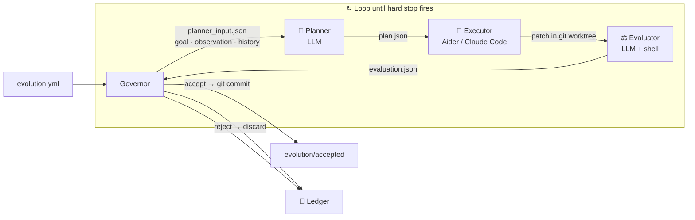

# Evolution Kernel

<p align="center">
  <strong>Give an LLM a goal. Watch your codebase improve itself. Stop when the budget runs out.</strong>
</p>

<p align="center">
  A ~1,200-line Python runtime that runs an autonomous, multi-round improvement loop on any codebase —<br>
  sandboxed in git worktrees, every decision logged, every change reversible.
</p>

<p align="center">
  <a href="README.zh.md">中文</a>
  ·
  <a href="docs/protocol.md">Protocol</a>
</p>

<p align="center">
  <a href="https://github.com/Protocol-zero-0/evolution-kernel/actions/workflows/tests.yml">
    
  </a>
  
  
  
  
</p>

---

<p align="center">
  <em>Think of it as AlphaEvolve — but pointed at your own repository.</em><br>
  <em>You define what "better" means. The kernel figures out how to get there.</em>
</p>

---

## What it does

Point Evolution Kernel at any git repository and give it a measurable goal. It runs a closed loop:

| Step | What happens |
|:---:|---|
| 🔍 **Observe** | Run your metric command — collect the current state (win rate, latency, error count, …) |
| 🧠 **Plan** | LLM reads the metric + history of prior attempts, produces a concrete plan |
| 🔨 **Execute** | Coding agent (Aider or Claude Code) applies the plan inside an isolated git worktree |
| ⚖️ **Evaluate** | Re-run your metric; LLM decides accept or reject |
| ✅ **Commit / rollback** | Accepted → real git commit on `evolution/accepted`. Rejected → worktree discarded |
| 🔁 **Loop** | Repeat until `max_iterations`, `max_total_usd`, or `max_total_tokens` fires |

Every attempt is written to a **ledger**: goal, observation, plan, diff, evaluation, decision. Nothing is held in memory. An external auditor — or your future self — can reconstruct every decision from the ledger alone.

---

## Quick Start

> The config below illustrates a real-world scenario (GSM8K math solver).
> `scripts/run_gsm8k.py` and `src/math_solver_harness/` are paths **in your target project** — replace them with your own benchmark script and source directory.
> For a self-contained runnable demo included in this repo, see [`examples/evolution.yml`](examples/evolution.yml).

```bash
# 1. Install
pip install evolution-kernel

# 2. Describe your goal
cat > evolution.yml << 'EOF'
mission: "Evolve the math-solver harness so Qwen3-8B-Instruct answers 90%+ of GSM8K problems correctly — no model retraining"

evidence_sources:
  - type: shell
    command: "python3 scripts/run_gsm8k.py --model qwen3-8b-instruct --sample 100 --json"

mutation_scope:
  allowed_paths: ["src/math_solver_harness/"]

hard_stops:
  max_iterations: 30
  max_consecutive_failures: 4
  max_total_usd: 40.00

llm:
  provider: anthropic
  model: claude-sonnet-4-6
  api_key_env: ANTHROPIC_API_KEY

coding_agent:
  tool: aider

history:
  max_entries: 10

roles:
  planner:   ["python3", "roles/planner.py"]
  executor:  ["bash",    "roles/executor.sh"]
  evaluator: ["python3", "roles/evaluator.py"]
EOF

# 3. Run overnight
evolution-kernel --config evolution.yml --repo /path/to/project --ledger /tmp/ledger --loop
```

---

## See it in action

> 📋 **Illustrative scenario.** The numbers below describe what a complete, well-targeted overnight run on the GSM8K case looks like — they are a design narrative, not a checked-in artifact in this repo. For runs anyone can reproduce today, see [`evidence/`](evidence/) and [`examples/demo_target`](examples/demo_target).

### $34. One night. An 8B model that runs on a MacBook — from 51.8% to 96.2% on elementary math. Zero weight changes.

> Qwen3-8B-Instruct is a general-purpose model with no math-specific training. Its weights are frozen throughout. Evolution Kernel evolves only the solver harness — prompt strategies, tools, and sampling logic. After one overnight run, the same model sits 2.8 points behind GPT-5.5. That means every child can have a free, local, always-on, privacy-safe math tutor.

```
                                         GSM8K pass rate (1,319 math word problems)
  GPT-5.5                  ████████████████████  99.0%
  Claude Opus 4.7          ████████████████████  98.6%
  ─────────────────────────────────────────────────────
  Qwen3-8B + ours          ███████████████████░  96.2%  ← after $34 overnight run
  ─────────────────────────────────────────────────────
  Early GPT-4              ██████████████████░░  92.0%
  Qwen3-8B baseline        ██████████░░░░░░░░░░  51.8%  ← raw model, naive prompt
```

Here is exactly what the loop did, generation by generation:

```
Model: Qwen3-8B-Instruct (frozen weights)   Scope: src/math_solver_harness/
Benchmark: GSM8K · 1,319 math word problems
Baseline: 51.8%   Reference: GPT-5.5: 99.0%  Opus 4.7: 98.6%  Early GPT-4: 92.0%

[gen 02] plan   → "Model answers directly. Require step-by-step Chain-of-Thought reasoning."
         execute→ aider rewrites harness/prompt.py
         eval   → 64.3%  ▲+12.5 pts — ACCEPT
         commit   a3f1c9e  "harness: chain-of-thought prompt (52→64%)"

[gen 05] plan   → "Single answer is brittle. Sample 5 solutions, vote on most common answer."
         execute→ aider adds harness/self_consistency.py
         eval   → 78.6%  ▲+14.3 pts — ACCEPT
         commit   8b2de01  "harness: self-consistency voting (64→79%)"

[gen 09] plan   → "Ledger shows arithmetic errors dominate failures.
                   Add Python calculator tool — outsource all numeric computation."
         execute→ aider adds harness/calculator_tool.py, updates orchestrator.py
         eval   → 87.4%  ▲+8.8 pts — ACCEPT
         commit   2c9af44  "harness: python calculator tool (79→87%)"

[gen 13] plan   → "After solving, substitute the answer back into the problem to verify.
                   If it doesn't check out, regenerate."
         execute→ aider adds harness/verifier.py
         eval   → 91.8%  ▲+4.4 pts — ACCEPT
         commit   9d7b321  "harness: answer verification loop (87→92%)"

[gen 17] plan   → "Multi-step problems have high failure rate. Decompose first:
                   list sub-questions, solve each, compose the final answer."
         execute→ aider adds harness/decomposer.py, updates orchestrator.py
         eval   → 94.6%  ▲+2.8 pts — ACCEPT
         commit   b4e1f22  "harness: problem decomposition (92→95%)"

[gen 21] plan   → "Prior gens each added one technique. Combine them:
                   best-of-16 sampling filtered by the verifier."
         execute→ aider integrates harness/best_of_n.py with verifier
         eval   → 96.2%  ▲+1.6 pts — ACCEPT  (2.8 pts behind GPT-5.5)
         commit   f8e2a11  "harness: best-of-16 + verifier (95→96%)"

[gen 25] STOP — 4 generations with no significant improvement

{"halted": true, "reason": "max_consecutive_failures reached (4)"}
```

```
Final:  51.8% → 96.2%   2.8 pts behind GPT-5.5 (99.0%), ahead of early GPT-4 (92.0%)
        $34.10 · 25 git commits · all changes in src/math_solver_harness/
        Model weights: 0 bytes changed   Harness: ~600 lines of Python
        Any 8B-class model can use this harness — local inference, zero API cost
```

> **Gen 09 is the tell.** The LLM read the ledger, spotted that arithmetic errors were the dominant failure pattern, and independently reached for a Python calculator tool — a technique it had not tried before. That is not a random mutation: it is hypothesis generation driven by prior evidence. This is what history injection does.

---

## Ledger: the complete audit trail

```
ledger/
  .evolution_state.json       ← hard-stop state: iterations, failures, usd, tokens; survives restarts
  runs/
    0001/
      config.json             ← full snapshot of your evolution.yml
      observation.json        ← raw output of your evidence_sources commands
      planner_input.json      ← goal + observation + history fed to planner
      plan.json               ← LLM plan: summary · steps · expected_improvement
      executor_input.json     ← plan + worktree path fed to executor
      executor_output.json    ← executor result
      evaluator_input.json    ← goal + patch + observation fed to evaluator
      patch.diff              ← exact diff the executor applied
      candidate_commit.txt    ← git SHA of the sandbox commit
      evaluation.json         ← verdict + metrics + cost_usd + tokens_used
      decision.json           ← accept / reject + reason
      reflection.json         ← one-line summary injected into the next round
    0002/  ...
  halted/
    20260501T120000Z.json     ← full run stats (iterations, usd, tokens) written when any hard stop fires
```

To undo every change from a session:

```bash
git checkout evolution/accepted
git reset --hard <baseline-sha>   # every accepted change is a named commit
```

---

## Architecture



**The Governor is intentionally dumb.** It is pure orchestration — zero LLM calls. All intelligence lives in the three role scripts. Swap any role for your own implementation; the Governor only cares about the JSON each role reads and writes.

**Roles communicate through files, not shared memory.** The planner never talks to the executor. The evaluator never sees the executor's self-assessment. The only shared state is the ledger.

---

## What works today

| Feature | Status |
|---|:---:|
| Multi-round LLM loop with memory (history injection) | ✅ |
| Budget guards: `max_total_usd`, `max_total_tokens` | ✅ |
| Iteration / consecutive-failure hard stops | ✅ |
| Full ledger audit trail (survives process restarts) | ✅ |
| Git worktree sandbox — every attempt isolated | ✅ |
| Scope enforcement — rejects changes outside `allowed_paths` | ✅ |
| Config-driven: swap LLM provider, model, coding agent | ✅ |
| Aider and Claude Code executor support | ✅ |
| Anthropic and OpenAI planner/evaluator support | ✅ |
| Goal evaluator — stops when mission is "won" | ✅ |
| k-branch parallel exploration (FunSearch / AlphaEvolve style) | ✅ |
| Process sandbox via firejail — executor cannot write outside its worktree | ✅ |
| Remote observer — HTTP evidence source for live dashboards / eval endpoints | ✅ |

---

## Configuration reference

> All paths (`scripts/run_gsm8k.py`, `src/math_solver_harness/`) refer to **your target project**, not this repo.
> Replace them with your own benchmark command and source directory.

```yaml
# Required — what "better" means for your project
mission: "Evolve the math-solver harness so Qwen3-8B-Instruct scores 90%+ on GSM8K — no model retraining"

# How to measure the current state
evidence_sources:
  - type: shell         # stdout goes into observation.json
    command: "python3 scripts/run_gsm8k.py --model qwen3-8b-instruct --sample 100 --json"
  - type: file          # file contents go into observation.json
    path: "metrics.json"
  - type: http          # GET a live endpoint; status, headers and body recorded
    url: "https://evals.example.com/run/latest"
    headers:
      Accept: application/json
    timeout: 10         # seconds (default 10)

# Only files under these paths may be changed
mutation_scope:
  allowed_paths:
    - "src/math_solver_harness/"   # changes outside this list are auto-rejected

# When to stop
hard_stops:
  max_iterations: 30            # total rounds
  max_consecutive_failures: 4   # consecutive rejections before halt
  max_total_usd: 3.00           # 0 = unlimited
  max_total_tokens: 0           # 0 = unlimited

# LLM for planner and evaluator
llm:
  provider: anthropic           # anthropic | openai
  model: claude-sonnet-4-6
  api_key_env: ANTHROPIC_API_KEY

# Coding agent for executor
coding_agent:
  tool: aider                   # aider | claude-code

# How many past rounds the planner sees
history:
  max_entries: 10

# Population-level search: per round, spawn k independent worktrees, score
# each branch's fitness, promote the best, demote the rest to ledger/failed/.
# k=1 (default) is plain single-branch run_once behavior.
parallel:
  k_branches: 1

# Process sandbox: when enabled, the executor's argv is wrapped with firejail
# so the rest of the filesystem is read-only and only the worktree + the
# run's ledger directory are writable. Planner and evaluator are read-mostly
# and run unsandboxed. Default off — v0.3 behavior is preserved.
sandbox:
  enabled: false                # set to true on machines with firejail installed
  backend: firejail
  extra_args: []                # appended verbatim before `--`

roles:
  planner:   ["python3", "roles/planner.py"]
  executor:  ["bash",    "roles/executor.sh"]
  evaluator: ["python3", "roles/evaluator.py"]
```

**Switch to OpenAI:**
```yaml
llm:
  provider: openai
  model: gpt-4o
  api_key_env: OPENAI_API_KEY
```

**Switch to Claude Code:**
```yaml
coding_agent:
  tool: claude-code
```

---

## CLI

```bash
# Loop until a hard stop fires  (recommended)
evolution-kernel --config evolution.yml --repo /path/to/repo --ledger /tmp/ledger --loop

# Single round
evolution-kernel --config evolution.yml --repo /path/to/repo --ledger /tmp/ledger

# Reset all hard-stop state (iterations, failures, budget) for a fresh session
evolution-kernel --ledger /tmp/ledger --reset
```

Exit codes: `0` clean finish · `3` halted by a hard stop.

---

## Install

```bash
pip install evolution-kernel
```

From source (only runtime dependency: PyYAML):

```bash
git clone https://github.com/Protocol-zero-0/evolution-kernel.git
cd evolution-kernel
pip install -e .
```

Python 3.10 or later.

---

## Tests

```bash
python3 -m pytest tests/ -v
```

39 tests · no network calls · roles replaced by lightweight fixture scripts.

---

## Writing your own roles

Each role is an executable that receives:

```
--input    <path>    JSON the governor wrote for this role
--output   <path>    JSON the role must write before exiting
--worktree <path>    path to the isolated git sandbox checkout
```

`roles/planner.py`, `roles/executor.sh`, and `roles/evaluator.py` are the reference implementation. Copy, modify, or replace them entirely — with a shell script, a Docker call, or anything that reads `--input` and writes `--output`.

---

## Project layout

```
evolution_kernel/   ~1,200-line runtime  (Governor · Observer · HardStops · Config · CLI)
roles/              reference planner, executor, evaluator
examples/           demo target + working evolution.yml
docs/               protocol spec
tests/              39 unit + acceptance tests
```

---

## License

MIT — see [LICENSE](LICENSE).
