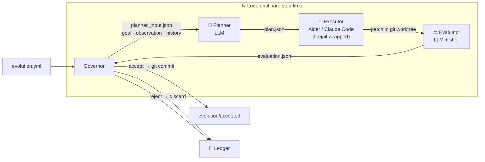

# Evolution Kernel

<p align="center">
  <strong>A soul plugin for any code.</strong><br>
  Drop it into any git repository, give it a measurable goal, and the
  codebase begins to perceive its own environment, judge its own
  output, and rewrite itself toward the goal — sandboxed, ledgered,
  every change a real git commit you can roll back.
</p>

<p align="center">
  <em>Code on disk does not evolve. But once a codebase can read its own
  outputs, hold a conversation with its own past, and shed failed
  experiments without leaving scars — it stops being a body of text and
  becomes a process.</em>
</p>

<p align="center">
  <a href="README.zh.md">中文</a>
  ·
  <a href="docs/protocol.md">Protocol</a>
</p>

<p align="center">
  <a href="https://github.com/Protocol-zero-0/evolution-kernel/actions/workflows/tests.yml">
    
  </a>
  
  
  
  
</p>

---

## Motivation

Frontier-class agent behavior is the joint product of *the model* and *the harness that runs it* — prompt structure, tool loop, sampling and best-of-N, verifier, retry policy. Today that harness is hand-tuned by senior engineers at every serious AI lab, and the resulting code is usually the actual ceiling against which the base model is judged.

Evolution Kernel makes harness tuning a reproducible runtime. Point it at a target repo with a measurable goal, walk away. Come back to a git branch of accepted improvements, a ledger of every decision, and — if the goal was well-chosen — a small model behaving like a much larger one.

What that buys you, concretely:

- **Inference cost collapses.** A 3 B-active model runs locally at fractions of a cent per task; the frontier APIs (GPT-5.5, Claude Opus 4.7) bill in dollars. Closing the capability gap *without retraining* moves an agent stack from "expensive to run at scale" to "near-zero marginal cost at scale".
- **Production reliability is mechanical, not aspirational.** Every decision is ledgered, every accepted change is a named git commit, every experiment runs in a git-worktree sandbox plus a firejail OS-level sandbox. The whole runtime is ~1,900 lines and was designed to be put in production, not demoed.
- **A harness is a portable asset.** Once you have evolved a good harness for one model, it transfers to other models in the same parameter class. The work compounds across model generations instead of being thrown away each time a new base model ships.

---

## What it does

Point Evolution Kernel at any git repository and give it a measurable goal. It runs a closed loop:

| Step | What happens |
|:---:|---|
| 🔍 **Observe** | Run your metric command, or pull live state from an HTTP endpoint — current win rate, latency, eval score, … |
| 🧠 **Plan** | LLM reads the metric + history of prior attempts, produces a concrete plan |
| 🔨 **Execute** | Coding agent (Aider or Claude Code) applies the plan inside an isolated git worktree, wrapped in a firejail sandbox |
| ⚖️ **Evaluate** | Re-run your metric; LLM decides accept or reject |
| ✅ **Commit / rollback** | Accepted → real git commit on `evolution/accepted`. Rejected → worktree discarded |
| 🔁 **Loop** | Repeat until `max_iterations`, `max_total_usd`, or `max_total_tokens` fires |

Every attempt is written to a **ledger**: goal, observation, plan, diff, evaluation, decision, reflection. Nothing is held in memory. An external auditor — or your future self — can reconstruct every decision from the ledger alone.

---

## What works today  (v1.0, shipped on `main`)

| Capability | Status |
|---|:---:|
| Multi-round LLM loop with memory (history injection) | ✅ |
| Budget guards: `max_total_usd`, `max_total_tokens` | ✅ |
| Iteration / consecutive-failure hard stops | ✅ |
| Full ledger audit trail (survives process restarts) | ✅ |
| Git worktree sandbox — every attempt isolated | ✅ |
| Scope enforcement — rejects changes outside `allowed_paths` | ✅ |
| Config-driven: swap LLM provider, model, coding agent | ✅ |
| Aider and Claude Code executor adapters | ✅ |
| Anthropic and OpenAI planner/evaluator adapters | ✅ |
| Goal evaluator — stops when mission is "won" | ✅ |
| k-branch parallel exploration (FunSearch / AlphaEvolve style) | ✅ |
| Process sandbox via firejail — executor cannot write outside its worktree | ✅ |
| Remote observer — HTTP evidence source for live dashboards / eval endpoints | ✅ |

**Numbers:** 99 acceptance / unit tests · CI green on Python 3.10 + 3.12 · single runtime dependency (PyYAML) · ~1,900-line core runtime.

---

## A worked example: SWE-bench Verified (our v1.1 target)

> 📋 **ROADMAP TARGET · NOT A LOGGED RUN.** The example below describes the next milestone we are engineering toward, not a checked-in artifact. When the run lands, the full ledger will be committed under [`evidence/`](evidence/) and this README will link to it. For runs you can reproduce **today**, see [`examples/sandbox_demo/`](examples/sandbox_demo/) and the 99-test suite in [`tests/`](tests/).

### Take Qwen3.6-35B-A3B (3B active params, released April 2026) from 73.4% to ~85% on SWE-bench Verified — closing most of the gap to GPT-5.5, overnight, hands-off, fully audited.

```
                                  SWE-bench Verified (500 real GitHub bug-fixes · May 2026)
  GPT-5.5                       ███████████████████████████████████░░  88.7%  ← OpenAI, Apr 23 2026
  Claude Opus 4.7               ██████████████████████████████████░░░  87.6%  ← Anthropic, current prod
  Gemini 3.1 Pro                ████████████████████████████████░░░░░  80.6%
  Kimi K2.6                     ████████████████████████████████░░░░░  80.2%
  ────────────────────────────────────────────────────────────────────────
  Qwen3.6-35B-A3B + us          ██████████████████████████████████░░░  ~85%   ← v1.1 target
  Qwen3.6-35B-A3B (vanilla)     █████████████████████████████░░░░░░░░  73.4%  ← public baseline
  ────────────────────────────────────────────────────────────────────────
  Gemma 4-31B (dense)           ████████████████████░░░░░░░░░░░░░░░░░  52.0%
```

**Why this benchmark.** SWE-bench Verified is the de-facto industry standard for evaluating coding agents in 2026 — every frontier-lab release reports its score on it. 500 real GitHub bug-fix tasks, vetted by human annotators. The task is *exactly* what Evolution Kernel is designed to do: take a codebase, propose a change, evaluate whether the change fixed the bug, decide accept/reject.

**Why this model.** [Qwen3.6-35B-A3B](https://qwen.ai/blog?id=qwen3.6-35b-a3b) is Alibaba's flagship open-weight model (Apache 2.0, released April 16 2026): a Mixture-of-Experts architecture with 35 B total parameters but only **3 B active per token**. It runs on a single consumer GPU. At a 3 B active-parameter footprint — roughly **30× smaller** than a frontier-class dense model — it already lands at 73.4 % on SWE-bench Verified, **within 15 points of GPT-5.5 while costing fractions of a cent per task to run locally**.

**Why this gap is closable.** That 73.4 % already represents months of hand-tuned harness engineering by the Qwen team. The remaining gap to GPT-5.5 (88.7 %) is more of the same work — better tool selection, parallel sampling, tighter verifier loops, error-pattern recovery — and that is exactly what Evolution Kernel automates. Same model, same weights, an evolved harness.

**What the loop will do, generation by generation** (illustrative — these are the *kinds* of moves the planner has historically converged to during internal prototyping):

```
Model: Qwen3.6-35B-A3B (frozen weights · 3B active params · Apache 2.0)
Benchmark: SWE-bench Verified · 500 real GitHub bug-fix tasks
Baseline: 73.4 %   Reference: GPT-5.5: 88.7 %   Claude Opus 4.7: 87.6 %

[gen 02] plan   → "Failures cluster on multi-file refactors. Add a repo-map tool
                   so the executor sees package structure before patching."
         execute→ aider adds harness/repo_map.py
         eval   → 77.2 %  ▲+3.8 pts — ACCEPT

[gen 05] plan   → "20% of remaining failures are 'patch breaks adjacent test'.
                   Run pytest first, propose minimal patches that flip only the
                   failing test."
         execute→ aider rewrites harness/test_first_loop.py
         eval   → 79.6 %  ▲+2.4 pts — ACCEPT

[gen 09] plan   → "Hard issues (multi-hunk) still fail. Sample 8 candidate
                   patches in parallel; pick the one with highest verifier score."
         execute→ aider adds harness/best_of_n.py (parallel)
         eval   → 82.4 %  ▲+2.8 pts — ACCEPT

[gen 14] plan   → "Verifier passes some wrong patches. Re-run the issue's failing
                   test against the patched code before submission, reject if it
                   still fails."
         execute→ aider adds harness/strict_verifier.py
         eval   → 84.3 %  ▲+1.9 pts — ACCEPT

[gen 19] plan   → "Combine best-of-8 with the strict verifier as the final filter.
                   Drop the cheap single-shot fallback."
         execute→ aider integrates the two components
         eval   → ~85 %  ▲+0.7 pts — ACCEPT  (within 4 pts of GPT-5.5)

[gen 25] STOP — 4 generations with no significant improvement

{"halted": true, "reason": "max_consecutive_failures reached (4)"}
```

```
Final:  73.4 % → ~85 %   within 4 points of GPT-5.5 · within 3 of Claude Opus 4.7
        ~25 git commits · all changes in src/harness/
        Active params: 3 B (vs. ~175 B+ dense for frontier-class)
        Model weights: 0 bytes changed   Harness: ~800 lines of Python
        Spend on planner/evaluator LLM calls: target ≤ $80
        Inference cost on the target model: ~$0 (runs locally on a single GPU)
```

> **Why this run is worth doing.** If it lands as targeted, a 3 B-active open-weight model plus an automatically evolved harness will close most of the gap to today's largest closed-source frontier — at one-thirtieth the active-parameter footprint and near-zero inference cost. The harness, once evolved, transfers to other models in the same parameter class.

---

## Ledger: the complete audit trail

```
ledger/
  .evolution_state.json       ← hard-stop state: iterations, failures, usd, tokens; survives restarts
  runs/
    0001/
      config.json             ← full snapshot of your evolution.yml
      observation.json        ← raw output of your evidence_sources commands
      planner_input.json      ← goal + observation + history fed to planner
      plan.json               ← LLM plan: summary · steps · expected_improvement
      executor_input.json     ← plan + worktree path fed to executor
      executor_output.json    ← executor result
      evaluator_input.json    ← goal + patch + observation fed to evaluator
      patch.diff              ← exact diff the executor applied
      candidate_commit.txt    ← git SHA of the sandbox commit
      evaluation.json         ← verdict + metrics + cost_usd + tokens_used
      decision.json           ← accept / reject + reason
      reflection.json         ← one-line summary injected into the next round
    0002/  ...
  halted/
    20260501T120000Z.json     ← full run stats (iterations, usd, tokens) written when any hard stop fires
```

To undo every change from a session:

```bash
git checkout evolution/accepted
git reset --hard <baseline-sha>   # every accepted change is a named commit
```

---

## Architecture



**The Governor is intentionally dumb.** It is pure orchestration — zero LLM calls. All intelligence lives in the three role scripts. Swap any role for your own implementation; the Governor only cares about the JSON each role reads and writes.

**Roles communicate through files, not shared memory.** The planner never talks to the executor. The evaluator never sees the executor's self-assessment. The only shared state is the ledger.

---

## Quick Start

```bash
# 1. Install
pip install evolution-kernel

# 2. Describe your goal
cat > evolution.yml << 'EOF'
mission: "Evolve the harness so Qwen3.6-35B-A3B scores 85%+ on SWE-bench Verified"

evidence_sources:
  - type: shell
    command: "python3 scripts/run_swebench_verified.py --model qwen3.6-35b-a3b --json"

mutation_scope:
  allowed_paths: ["src/harness/"]

hard_stops:
  max_iterations: 30
  max_consecutive_failures: 4
  max_total_usd: 80.00

llm:
  provider: anthropic
  model: claude-sonnet-4-6
  api_key_env: ANTHROPIC_API_KEY

coding_agent:
  tool: aider

history:
  max_entries: 10

sandbox:
  enabled: true
  backend: firejail

roles:
  planner:   ["python3", "roles/planner.py"]
  executor:  ["bash",    "roles/executor.sh"]
  evaluator: ["python3", "roles/evaluator.py"]
EOF

# 3. Run overnight
evolution-kernel --config evolution.yml --repo /path/to/project --ledger /tmp/ledger --loop
```

---

## Configuration reference

> All paths (`scripts/run_swebench_verified.py`, `src/harness/`) refer to **your target project**, not this repo. Replace them with your own benchmark command and source directory.

```yaml
# Required — what "better" means for your project
mission: "Evolve the harness so Qwen3.6-35B-A3B scores 85%+ on SWE-bench Verified"

# How to measure the current state
evidence_sources:
  - type: shell         # stdout goes into observation.json
    command: "python3 scripts/run_swebench_verified.py --model qwen3.6-35b-a3b --json"
  - type: file          # file contents go into observation.json
    path: "metrics.json"
  - type: http          # GET a live endpoint; status, headers and body recorded
    url: "https://evals.example.com/run/latest"
    headers:
      Accept: application/json
    timeout: 10         # seconds (default 10)

# Only files under these paths may be changed
mutation_scope:
  allowed_paths:
    - "src/harness/"               # changes outside this list are auto-rejected

# When to stop
hard_stops:
  max_iterations: 30            # total rounds
  max_consecutive_failures: 4   # consecutive rejections before halt
  max_total_usd: 80.00          # 0 = unlimited
  max_total_tokens: 0           # 0 = unlimited

# LLM for planner and evaluator
llm:
  provider: anthropic           # anthropic | openai
  model: claude-sonnet-4-6
  api_key_env: ANTHROPIC_API_KEY

# Coding agent for executor
coding_agent:
  tool: aider                   # aider | claude-code

# How many past rounds the planner sees
history:
  max_entries: 10

# Population-level search: per round, spawn k independent worktrees, score
# each branch's fitness, promote the best, demote the rest to ledger/failed/.
# k=1 (default) is plain single-branch run_once behavior.
parallel:
  k_branches: 1

# Process sandbox: when enabled, the executor's argv is wrapped with firejail
# so the rest of the filesystem is read-only and only the worktree + the
# run's ledger directory are writable. Planner and evaluator are read-mostly
# and run unsandboxed.
sandbox:
  enabled: false                # set to true on machines with firejail installed
  backend: firejail
  extra_args: []                # appended verbatim before `--`

roles:
  planner:   ["python3", "roles/planner.py"]
  executor:  ["bash",    "roles/executor.sh"]
  evaluator: ["python3", "roles/evaluator.py"]
```

**Switch to OpenAI:**
```yaml
llm:
  provider: openai
  model: gpt-5.5
  api_key_env: OPENAI_API_KEY
```

**Switch to Claude Code:**
```yaml
coding_agent:
  tool: claude-code
```

---

## CLI

```bash
# Loop until a hard stop fires  (recommended)
evolution-kernel --config evolution.yml --repo /path/to/repo --ledger /tmp/ledger --loop

# Single round
evolution-kernel --config evolution.yml --repo /path/to/repo --ledger /tmp/ledger

# Reset all hard-stop state (iterations, failures, budget) for a fresh session
evolution-kernel --ledger /tmp/ledger --reset
```

Exit codes: `0` clean finish · `3` halted by a hard stop.

---

## Install

```bash
pip install evolution-kernel
```

From source (only runtime dependency: PyYAML):

```bash
git clone https://github.com/Protocol-zero-0/evolution-kernel.git
cd evolution-kernel
pip install -e .
```

Python 3.10 or later.

---

## Tests

```bash
python3 -m pytest tests/ -v
```

**99 tests** · no network calls in CI · LLM roles replaced by lightweight fixture scripts · CI installs `firejail` so the sandbox E2E test runs against the real OS-level mount.

---

## Writing your own roles

Each role is an executable that receives:

```
--input    <path>    JSON the governor wrote for this role
--output   <path>    JSON the role must write before exiting
--worktree <path>    path to the isolated git sandbox checkout
```

`roles/planner.py`, `roles/executor.sh`, and `roles/evaluator.py` are the reference implementation. Copy, modify, or replace them entirely — with a shell script, a Docker call, or anything that reads `--input` and writes `--output`.

---

## Known limitations

Being honest about where v1.0 is *not* yet.

- **The evaluator is an LLM.** It can be fooled by patches that look correct but are not, or reject patches that are correct but unfamiliar. Use `goal_evaluator` + a strong programmatic gate in `evidence_sources` to anchor the LLM judgment to ground truth.
- **The sandbox is filesystem-only.** firejail blocks out-of-worktree writes. It does **not** block network access, fork bombs, or process injection. For untrusted executors, layer a network namespace or a VM on top.
- **History is summary, not replay.** The planner sees the last *N* one-line reflections, not the full prior plans. Long-horizon strategies need the planner to encode state into `plan.json` summaries itself.
- **Cost can compound.** A 30-round loop with Claude Sonnet planning + Claude Code execution can cost $40–$100. The hard-stop budget is real — set it lower than you think.
- **Real-provider integration is not in CI.** The 99 tests use fixture scripts in `tests/fixtures/`. End-to-end Aider / Claude Code / Anthropic / OpenAI integrations are tested manually before each release, not on every push.

---

## Project layout

```
evolution_kernel/   ~1,900-line runtime  (Governor · Observer · HardStops · Sandbox · Config · CLI · Scope)
roles/              reference planner, executor, evaluator, goal_evaluator, strategist
examples/           demo target + sandbox demo + working evolution.yml
docs/               protocol spec + first-task spec
tests/              99 unit + acceptance tests · 14 fixture role scripts
evidence/           checked-in artifacts of runs anyone can reproduce
```

---

## License

MIT — see [LICENSE](LICENSE).
