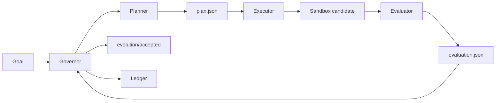

# Evolution Kernel

<p align="center">
  <strong>A general-purpose evolution engine for autonomously improving software projects.</strong>
</p>

<p align="center">
  <a href="README.zh.md">中文</a>
  ·
  <a href="docs/protocol.md">Protocol</a>
  ·
  <a href="docs/token-ignition-first-task.md">First Target</a>
</p>

<p align="center">
  
  = 3.10">
  
  
</p>

**Evolution Kernel** is a minimal protocol and runtime for autonomous, self-evolving software systems.

It is not a project-specific automation script. Its purpose is to make software evolution **controlled, reproducible, sandboxed, auditable, and reversible**. Any project can become an optimization target once it can expose a goal, a sandbox, and an evaluator.

## Why It Exists

Modern coding agents can propose and modify code, but long-running software improvement needs more than code generation. It needs a kernel that can:

- define what improvement means for a target project,
- isolate each experiment before it touches the accepted branch,
- evaluate candidate changes with repeatable criteria,
- promote only accepted candidates,
- keep a ledger of what happened and why.

Evolution Kernel provides that loop as a small, inspectable runtime.

## Evolution Loop



## First Optimization Target

Evolution Kernel is designed to optimize **any** software project. The first project being optimized is **Token-Ignition**, specifically its backend evaluator.

Token-Ignition is therefore the first optimization target and reference adapter, not a hard dependency. It is used to prove that the kernel can safely and deterministically evolve a real codebase while keeping the runtime small.

## Current Status

The current v0 implementation provides the foundational runtime:

| Area | What exists now |
| --- | --- |
| Governor | Deterministic orchestration for planning, execution, evaluation, promotion, rollback, and ledger updates. |
| Sandbox | Git worktree-based experiment isolation. Candidate changes do not affect the accepted branch unless promoted. |
| Role handoff | `planner`, `executor`, and `evaluator` run as isolated commands and communicate through JSON files. |
| Promotion model | Accepted candidates advance the local `evolution/accepted` branch. Rejected experiments remain recorded but do not advance it. |
| First adapter | A Token-Ignition adapter with a hand-written golden set for evaluator evolution. |

## What It Does Not Do Yet

| Not yet | Why it matters |
| --- | --- |
| LLM-native planner/executor | The current tests use fixture scripts; real agent integrations are the next step. |
| Strong process/container sandboxing | Git worktrees isolate files, but executor and evaluator isolation should become stronger. |
| Multi-target adapter framework | Token-Ignition is the first target; more adapters are needed to prove generality. |
| Parallel evolution branches | v0 focuses on one accepted branch and a simple promotion path. |

## Roadmap

- [ ] Add LLM-driven planner and executor implementations.
- [ ] Add stronger sandbox isolation for executor and evaluator runs.
- [ ] Generalize the adapter interface beyond Token-Ignition.
- [ ] Add examples for multiple project types.
- [ ] Support parallel evolution branches and richer merge strategies.
- [ ] Improve reporting around ledger history, promotion decisions, and rejected candidates.

## Documents

- [Protocol](docs/protocol.md)
- [Token-Ignition First Task](docs/token-ignition-first-task.md)

## Run Tests

```bash
python3 -m unittest discover -s tests -v
python3 adapters/token_ignition/evaluate_golden_cases.py
```

## CLI Shape

YAML-config mode (the primary MVP entry point — observer + scope + hard stops):

```bash
python3 -m evolution_kernel.cli \
  --config /path/to/evolution.yml \
  --repo /path/to/target-repo \
  --ledger /path/to/evolution-ledger
```

Legacy direct-flags mode (still supported for the original golden-case tests):

```bash
python3 -m evolution_kernel.cli \
  --repo /path/to/target-repo \
  --ledger /path/to/evolution-ledger \
  --goal /path/to/goal.json \
  --planner python3 /path/to/planner.py \
  --executor python3 /path/to/executor.py \
  --evaluator python3 /path/to/evaluator.py
```

Reset the persistent hard-stop state (after a halt) without running a loop:

```bash
python3 -m evolution_kernel.cli --reset --ledger /path/to/evolution-ledger
```

Each role command receives:

```text
--input <json>
--output <json>
--worktree <sandbox path>
```

## MVP Usage (closed loop with observer, scope, hard stops)

This MVP wires the full closed loop described in the protocol:
`config -> observe -> plan/execute -> evaluate -> accept/reject -> ledger`.

### 1. Author an `evolution.yml`

```yaml
mission: "Add a minimal in-scope mutation so the evaluator accepts."

evidence_sources:
  - type: file
    path: metrics.json
  - type: shell
    command: "bash scripts/status.sh"

mutation_scope:
  allowed_paths:
    - "src/"

hard_stops:
  max_iterations: 3
  max_consecutive_failures: 2

roles:
  planner:   ["python3", "bots/planner.py"]
  executor:  ["python3", "bots/executor.py"]
  evaluator: ["python3", "bots/evaluator.py"]
```

`evidence_sources` are read into `observation.json` before the planner runs.
`mutation_scope.allowed_paths` are enforced after the executor commits — anything
outside the scope is auto-rejected with `decision.reason = "scope_violation: ..."`.
`hard_stops` persist across runs in `<ledger>/.evolution_state.json` so a stuck
loop halts even across CLI invocations.

### 2. Run a single iteration

```bash
# one-time: install the package (pulls PyYAML, the only runtime dep)
python3 -m pip install -e .

# one-time: prepare a target repo
bash examples/demo_target/setup.sh

python3 -m evolution_kernel.cli \
  --config examples/evolution.yml \
  --repo  examples/demo_target \
  --ledger /tmp/ek-ledger
```

> The `pip install -e .` step is only needed once per environment — it pulls
> `PyYAML>=6.0` (declared in `pyproject.toml`). After that the three-line
> command above is reproducible from a clean checkout.

Reset the persistent hard-stop counters when you want to start fresh:

```bash
python3 -m evolution_kernel.cli --reset --ledger /tmp/ek-ledger
```

### 3. Inspect the ledger

Every run produces a directory under `<ledger>/runs/<run_id>/` containing the
full evidence trail:

```text
goal.json              # legacy mode only
config.json            # full snapshot of the YAML config (full mode)
observation.json       # what the observer collected before planning
plan.json              # planner output
patch.diff             # diff between baseline and candidate commit
candidate_commit.txt   # the candidate commit hash inside the sandbox
evaluation.json        # evaluator output (synthesised on scope_violation)
decision.json          # accept / reject + reason
reflection.json        # post-decision summary
```

### 4. Acceptance criteria -> tests

The six acceptance bullets from issue #1 each map to a test in
`tests/test_acceptance.py`:

| # | Acceptance bullet | Test |
| - | --- | --- |
| 1 | Accept advances `evolution/accepted` | `test_accept_advances_accepted_branch` |
| 2 | Reject does not advance it | `test_reject_does_not_advance_accepted_branch` |
| 3 | Mutation scope enforced + violation logged | `test_scope_violation_is_rejected_and_logged` |
| 4 | Observer writes `observation.json` (file + shell) | `test_observer_writes_observation_with_file_and_shell` |
| 5 | Hard stops halt then `reset` re-enables | `test_hard_stop_blocks_then_reset_allows_via_cli` |
| 6 | Ledger contains all required artifacts | `test_ledger_contains_all_required_artifacts` |

### What this MVP intentionally does **not** do

In line with the issue's "out of scope" list:

- No LLM / agent-swarm / dashboard.
- No PR router and no auto-merge to upstream `main`.
- No multi-target adapter framework — the only example target is
  `examples/demo_target/`.
- No container/process sandbox beyond git worktrees.

These are the natural next steps once the kernel itself is trusted.
