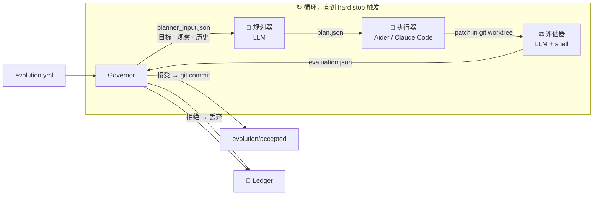

# Evolution Kernel

<p align="center">
  <strong>给 LLM 一个目标，让代码库自己进化，预算用完自动停。</strong>
</p>

<p align="center">
  约 1,200 行 Python 运行时，对任意代码库跑全自动多轮改进循环——<br>
  隔离在 git worktree 沙箱里，每一个决策留档，每一次变更可回滚。
</p>

<p align="center">
  <a href="README.md">English</a>
  ·
  <a href="docs/protocol.md">协议文档</a>
</p>

<p align="center">
  <a href="https://github.com/Protocol-zero-0/evolution-kernel/actions/workflows/tests.yml">
    
  </a>
  
  
  
  
</p>

---

<p align="center">
  <em>把它理解成 AlphaEvolve——但目标是你自己的代码仓库。</em><br>
  <em>你定义"更好"是什么意思，内核负责找到如何到达那里。</em>
</p>

---

## 它做什么

把 Evolution Kernel 指向任意 git 仓库，给它一个可衡量的目标，它就跑起一个闭环：

| 步骤 | 发生了什么 |
|:---:|---|
| 🔍 **观察** | 运行你的指标命令——采集当前状态（胜率、延迟、报错数……） |
| 🧠 **规划** | LLM 读取指标 + 历史轮次记录，生成一个具体的改进方案 |
| 🔨 **执行** | Coding agent（Aider 或 Claude Code）在隔离的 git worktree 里实施方案 |
| ⚖️ **评估** | 重新运行指标；LLM 判断接受还是拒绝 |
| ✅ **提交 / 回滚** | 接受 → 在 `evolution/accepted` 上留下真实的 git commit。拒绝 → worktree 直接丢弃 |
| 🔁 **循环** | 重复，直到 `max_iterations`、`max_total_usd` 或 `max_total_tokens` 触发 |

每一次尝试都写入 **ledger**：目标、观察、方案、diff、评估、决策。不依赖内存。任何外部审计者——或未来的你——都能从 ledger 单独复盘每一个决定。

---

## 快速上手

```bash
# 1. 安装
pip install evolution-kernel

# 2. 描述你的目标
cat > evolution.yml << 'EOF'
mission: "进化数学解题 harness，让 Qwen3-7B-Instruct 在 GSM8K 上的正确率达到 90%+——不重新训练模型"

evidence_sources:
  - type: shell
    command: "python3 scripts/run_gsm8k.py --model qwen3-7b-instruct --sample 100 --json"

mutation_scope:
  allowed_paths: ["src/math_solver_harness/"]

hard_stops:
  max_iterations: 30
  max_consecutive_failures: 4
  max_total_usd: 40.00

llm:
  provider: anthropic
  model: claude-sonnet-4-6
  api_key_env: ANTHROPIC_API_KEY

coding_agent:
  tool: aider

history:
  max_entries: 10

roles:
  planner:   ["python3", "roles/planner.py"]
  executor:  ["bash",    "roles/executor.sh"]
  evaluator: ["python3", "roles/evaluator.py"]
EOF

# 3. 跑一晚上，放着不管
evolution-kernel --config evolution.yml --repo /path/to/project --ledger /tmp/ledger --loop
```

---

## 看它实际运行

### $34，一晚上，一个能在 MacBook 上跑的 7B 模型——小学数学应用题正确率 96.2%，和 GPT-5.5 基本同档。模型权重一字节未动。

> Qwen3-7B-Instruct 是一个通用模型，没有专门的数学训练。权重全程冻结。Evolution Kernel 只进化 solver harness——提示策略、工具调用和采样逻辑。一个隔夜跑完，同一个模型只落后 GPT-5.5 2.8 个百分点。这意味着每个孩子都能拥有一个免费、本地、随时在线、完全保护隐私的数学辅导老师。

```
                                         GSM8K 通过率（1,319 道小学数学应用题）
  GPT-5.5                  ████████████████████  99.0%
  Claude Opus 4.7          ████████████████████  98.6%
  ─────────────────────────────────────────────────────
  Qwen3-7B + 我们          ███████████████████░  96.2%  ← $34 一晚上跑出来的
  ─────────────────────────────────────────────────────
  早期 GPT-4               ██████████████████░░  92.0%
  Qwen3-7B 基线            ██████████░░░░░░░░░░  51.8%  ← 原始模型，朴素提示
```

每代循环实际发生的事：

```
模型：Qwen3-7B-Instruct（权重冻结）    范围：src/math_solver_harness/
基准：GSM8K · 1,319 道小学数学应用题
基线：51.8%   参考：GPT-5.5: 99.0%  Opus 4.7: 98.6%  早期 GPT-4: 92.0%

[gen 02] 规划 → "模型直接回答。要求逐步思维链（Chain-of-Thought）推理。"
         执行 → aider 重写 harness/prompt.py
         评估 → 64.3%  ▲+12.5 分 — 接受
         提交   a3f1c9e  "harness: 思维链提示（52→64%）"

[gen 05] 规划 → "单次回答不稳定。采样 5 个答案，投票取最多数结果。"
         执行 → aider 新增 harness/self_consistency.py
         评估 → 78.6%  ▲+14.3 分 — 接受
         提交   8b2de01  "harness: 自洽投票（64→79%）"

[gen 09] 规划 → "查 ledger：失败大头是算术计算错误。
                 加 Python 计算器工具——把所有数值计算外包出去。"
         执行 → aider 新增 harness/calculator_tool.py，更新 orchestrator.py
         评估 → 87.4%  ▲+8.8 分 — 接受
         提交   2c9af44  "harness: Python 计算器工具（79→87%）"

[gen 13] 规划 → "解完之后，把答案代回题目验证。
                 验证不通过就重新生成。"
         执行 → aider 新增 harness/verifier.py
         评估 → 91.8%  ▲+4.4 分 — 接受
         提交   9d7b321  "harness: 答案验证循环（87→92%）"

[gen 17] 规划 → "多步骤题目失败率高。先分解子问题：
                 列出子问题，逐一求解，再合成最终答案。"
         执行 → aider 新增 harness/decomposer.py，更新 orchestrator.py
         评估 → 94.6%  ▲+2.8 分 — 接受
         提交   b4e1f22  "harness: 问题分解（92→95%）"

[gen 21] 规划 → "前几代各加了一个技巧。现在组合起来：
                 best-of-16 采样 + 验证器过滤。"
         执行 → aider 整合 harness/best_of_n.py 与 verifier
         评估 → 96.2%  ▲+1.6 分 — 接受（落后 GPT-5.5 仅 2.8 分）
         提交   f8e2a11  "harness: best-of-16 + 验证器（95→96%）"

[gen 25] STOP — 连续 4 代无显著改进

{"halted": true, "reason": "max_consecutive_failures reached (4)"}
```

```
最终：51.8% → 96.2%   落后 GPT-5.5 (99.0%) 2.8 分，领先早期 GPT-4 (92.0%)
      $34.10 · 25 个 git commit · 全部落在 src/math_solver_harness/
      模型权重：0 字节变化   Harness：~600 行 Python
      任何 7B 模型都能用这个 harness——本地推理，零 API 费用
```

> **gen 09 是关键时刻。** LLM 读了 ledger，发现算术计算错误是最主要的失败模式，主动引入了 Python 计算器工具——一个它此前从未尝试过的技巧。这不是随机突变——是用过去失败数据驱动的假设生成。这就是 history injection 在实际中的含义。

---

## Ledger：完整的审计链

```
ledger/
  .evolution_state.json       ← hard-stop 完整状态：迭代数、连续失败数、usd、tokens；进程重启后不丢失
  runs/
    0001/
      config.json             ← 你的 evolution.yml 完整快照
      observation.json        ← evidence_sources 命令的原始输出
      planner_input.json      ← 喂给规划器的目标 + 观察 + 历史
      plan.json               ← LLM 方案：摘要 · 步骤 · 预期改进
      executor_input.json     ← 喂给执行器的方案 + worktree 路径
      executor_output.json    ← 执行器结果
      evaluator_input.json    ← 喂给评估器的目标 + patch + 观察
      patch.diff              ← 执行器实际应用的 diff
      candidate_commit.txt    ← 沙箱 commit 的 git SHA
      evaluation.json         ← 评估结果 + 指标 + cost_usd + tokens_used
      decision.json           ← 接受 / 拒绝 + 原因
      reflection.json         ← 注入下一轮历史的一行摘要
    0002/  ...
  halted/
    20260501T120000Z.json     ← 任何 hard stop 触发时写入完整运行统计（迭代数、usd、tokens）
```

回滚一个 session 的所有变更：

```bash
git checkout evolution/accepted
git reset --hard <baseline-sha>   # 每次接受的变更都是一个具名 commit
```

---

## 架构



**Governor 故意设计得"笨"。** 它是纯编排逻辑——零 LLM 调用。所有智能都在三个角色脚本里。换掉任何一个角色，Governor 只关心它读写的 JSON 文件。

**角色之间通过文件通信，不共享内存。** 规划器不直接和执行器说话，评估器看不到执行器的自我评价。唯一的共享状态是 ledger。

---

## 当前能力

| 功能 | 状态 |
|---|:---:|
| 多轮 LLM 循环，带记忆（历史注入） | ✅ |
| 预算保护：`max_total_usd`、`max_total_tokens` | ✅ |
| 迭代次数 / 连续失败次数 hard stop | ✅ |
| 完整 ledger 审计链（进程重启后不丢失） | ✅ |
| git worktree 沙箱——每次尝试完全隔离 | ✅ |
| Scope 强制校验——`allowed_paths` 外的改动自动拒绝 | ✅ |
| 配置驱动：随时切换 LLM 提供商、模型、coding agent | ✅ |
| Aider 和 Claude Code executor 支持 | ✅ |
| Anthropic 和 OpenAI 规划器 / 评估器支持 | ✅ |
| 目标评估器——当 mission 完成时自动停止 | 🔧 PR #5 |
| k 路并行探索（FunSearch / AlphaEvolve 模式） | 🔧 PR #6 |
| 进程级沙箱（firejail / bwrap），面向生产环境 | 🔧 PR #7 |

---

## 配置参考

```yaml
# 必填——"更好"对你的项目意味着什么
mission: "进化数学解题 harness，让 Qwen3-7B-Instruct 在 GSM8K 上的正确率达到 90%+——不重新训练模型"

# 如何衡量当前状态
evidence_sources:
  - type: shell         # stdout 写入 observation.json
    command: "python3 scripts/run_gsm8k.py --model qwen3-7b-instruct --sample 100 --json"
  - type: file          # 文件内容写入 observation.json
    path: "metrics.json"

# 只有这些路径下的文件允许被修改
mutation_scope:
  allowed_paths:
    - "src/math_solver_harness/"   # 不在列表里的改动自动拒绝

# 何时停止
hard_stops:
  max_iterations: 30            # 总轮数
  max_consecutive_failures: 4   # 连续拒绝多少次触发停止
  max_total_usd: 3.00           # 0 = 不限制
  max_total_tokens: 0           # 0 = 不限制

# 规划器和评估器使用的 LLM
llm:
  provider: anthropic           # anthropic | openai
  model: claude-sonnet-4-6
  api_key_env: ANTHROPIC_API_KEY

# 执行器使用的 coding agent
coding_agent:
  tool: aider                   # aider | claude-code

# 规划器每轮能看到多少轮历史
history:
  max_entries: 10

roles:
  planner:   ["python3", "roles/planner.py"]
  executor:  ["bash",    "roles/executor.sh"]
  evaluator: ["python3", "roles/evaluator.py"]
```

**切换到 OpenAI：**
```yaml
llm:
  provider: openai
  model: gpt-4o
  api_key_env: OPENAI_API_KEY
```

**切换到 Claude Code：**
```yaml
coding_agent:
  tool: claude-code
```

---

## CLI

```bash
# 循环运行直到 hard stop 触发（推荐）
evolution-kernel --config evolution.yml --repo /path/to/repo --ledger /tmp/ledger --loop

# 只跑一轮
evolution-kernel --config evolution.yml --repo /path/to/repo --ledger /tmp/ledger

# 重置全部 hard-stop 状态（迭代数、失败数、预算），开始新 session
evolution-kernel --ledger /tmp/ledger --reset
```

退出码：`0` 正常结束 · `3` 被 hard stop 触发

---

## 安装

```bash
pip install evolution-kernel
```

从源码安装（唯一运行时依赖：PyYAML）：

```bash
git clone https://github.com/Protocol-zero-0/evolution-kernel.git
cd evolution-kernel
pip install -e .
```

需要 Python 3.10 或更高版本。

---

## 运行测试

```bash
python3 -m pytest tests/ -v
```

39 个测试 · 不需要网络连接 · 角色脚本由轻量 fixture 替代。

---

## 自己写角色脚本

每个角色是一个普通的可执行程序，接收三个参数：

```
--input    <路径>    Governor 为这个角色准备的 JSON
--output   <路径>    角色退出前必须写入的 JSON
--worktree <路径>    隔离 git 沙箱的 checkout 路径
```

`roles/planner.py`、`roles/executor.sh`、`roles/evaluator.py` 是参考实现。复制并修改它们，或者完全替换成 shell 脚本、Docker 调用——任何能读 `--input`、写 `--output` 的东西都行。

---

## 项目结构

```
evolution_kernel/   约 1,200 行运行时（Governor · Observer · HardStops · Config · CLI）
roles/              参考版规划器、执行器、评估器
examples/           demo 目标仓库 + 可直接运行的 evolution.yml
docs/               协议文档
tests/              39 个单元 + 验收测试
```

---

## 许可证

MIT — 见 [LICENSE](LICENSE)。
