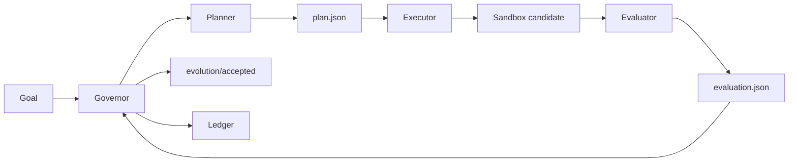

# Evolution Kernel

<p align="center">
  <strong>一个用于自主优化软件项目的通用进化引擎。</strong>
</p>

<p align="center">
  <a href="README.md">English</a>
  ·
  <a href="docs/protocol.md">协议</a>
  ·
  <a href="docs/token-ignition-first-task.md">首个优化对象</a>
</p>

<p align="center">
  
  = 3.10">
  
  
</p>

**Evolution Kernel** 是一个面向“自主自我进化软件系统”的最小协议与运行时。

它不是某个具体项目的自动化脚本，而是一个通用的进化内核。它的目标是让软件项目的持续改进过程变得**可控、可复现、可沙箱化、可审计、可回滚**。只要一个项目能够提供目标、沙箱和评估器，就可以成为它的优化对象。

## 为什么需要它

现代 coding agent 可以提出并修改代码，但长期的软件自我改进不只需要代码生成，还需要一个稳定的内核来管理整个进化闭环：

- 定义目标项目里的“改进”到底意味着什么；
- 在影响已接受分支之前隔离每一次实验；
- 用可复现的标准评估候选变更；
- 只晋升通过评估的候选结果；
- 记录每次实验发生了什么、为什么接受或拒绝。

Evolution Kernel 将这个闭环做成一个小而可检查的运行时。

## 进化闭环



## 首个优化对象

Evolution Kernel 的定位是优化**任何**软件项目。它第一个正在优化的项目是 **Token-Ignition**，具体对象是 Token-Ignition 的后端评估器。

因此，Token-Ignition 是第一个优化对象和参考适配器，不是 Evolution Kernel 的硬依赖。它用来验证这个内核能否安全、确定性地进化一个真实代码库，同时保持运行时足够小。

## 当前状态

当前 v0 版本已经实现了基础运行时：

| 模块 | 当前已实现 |
| --- | --- |
| Governor | 确定性编排 planning、execution、evaluation、promotion、rollback 和 ledger 更新。 |
| Sandbox | 基于 Git worktree 的实验隔离。候选变更只有被晋升后才会影响已接受分支。 |
| 角色交接 | `planner`、`executor`、`evaluator` 作为隔离命令运行，并通过 JSON 文件通信。 |
| 晋升模型 | 被接受的候选结果推进本地 `evolution/accepted` 分支；被拒绝的实验只保留记录，不推进该分支。 |
| 首个适配器 | Token-Ignition 适配器，包含用于评估器进化的手写 golden set。 |

## 目前还没有做什么

| 尚未完成 | 为什么重要 |
| --- | --- |
| LLM-native planner/executor | 当前测试使用 fixture 脚本；真实 agent 接入是下一步。 |
| 更强的进程/容器级沙箱 | Git worktree 能隔离文件，但 executor 和 evaluator 的运行隔离还应进一步增强。 |
| 多目标适配器框架 | Token-Ignition 是第一个目标；还需要更多适配器来证明通用性。 |
| 并行进化分支 | v0 目前聚焦单一 accepted 分支和简单晋升路径。 |

## Roadmap

- [ ] 增加 LLM 驱动的 planner 和 executor 实现。
- [ ] 为 executor 和 evaluator 增加更强的沙箱隔离。
- [ ] 将适配器接口从 Token-Ignition 推广为通用接口。
- [ ] 增加多个不同类型项目的 examples。
- [ ] 支持并行进化分支和更丰富的合并策略。
- [ ] 改进 ledger 历史、晋升决策、拒绝候选的报告能力。

## 文档

- [协议](docs/protocol.md)
- [Token-Ignition 首个任务](docs/token-ignition-first-task.md)

## 运行测试

```bash
python3 -m unittest discover -s tests -v
python3 adapters/token_ignition/evaluate_golden_cases.py
```

## CLI 形状

YAML 配置模式（MVP 主入口 — 包含 observer + scope + hard stops）：

```bash
python3 -m evolution_kernel.cli \
  --config /path/to/evolution.yml \
  --repo /path/to/target-repo \
  --ledger /path/to/evolution-ledger
```

旧版直接传参模式（保留以兼容原始的 golden-case 测试）：

```bash
python3 -m evolution_kernel.cli \
  --repo /path/to/target-repo \
  --ledger /path/to/evolution-ledger \
  --goal /path/to/goal.json \
  --planner python3 /path/to/planner.py \
  --executor python3 /path/to/executor.py \
  --evaluator python3 /path/to/evaluator.py
```

熔断后清空持久化的 hard-stop 状态（不会触发一次 run）：

```bash
python3 -m evolution_kernel.cli --reset --ledger /path/to/evolution-ledger
```

每个角色命令都会收到：

```text
--input <json>
--output <json>
--worktree <sandbox path>
```

## MVP 使用方式（observer + scope + hard stops 闭环）

本 MVP 串起协议描述的完整闭环：
`config -> observe -> plan/execute -> evaluate -> accept/reject -> ledger`。

### 1. 编写 `evolution.yml`

```yaml
mission: "Add a minimal in-scope mutation so the evaluator accepts."

evidence_sources:
  - type: file
    path: metrics.json
  - type: shell
    command: "bash scripts/status.sh"

mutation_scope:
  allowed_paths:
    - "src/"

hard_stops:
  max_iterations: 3
  max_consecutive_failures: 2

roles:
  planner:   ["python3", "bots/planner.py"]
  executor:  ["python3", "bots/executor.py"]
  evaluator: ["python3", "bots/evaluator.py"]
```

`evidence_sources` 在 planner 运行前被读入 `observation.json`。
`mutation_scope.allowed_paths` 在 executor 提交后被强制校验 —— 范围之外
的任何改动都会被自动 reject，`decision.reason` 写为 `scope_violation: ...`。
`hard_stops` 通过 `<ledger>/.evolution_state.json` 跨 run 持久化，循环卡死
时即使重启 CLI 也会被拦截。

### 2. 跑一次实验

```bash
# 一次性：安装包（PyYAML 是唯一运行时依赖，已在 pyproject.toml 声明）
python3 -m pip install -e .

# 一次性：准备目标仓库
bash examples/demo_target/setup.sh

python3 -m evolution_kernel.cli \
  --config examples/evolution.yml \
  --repo  examples/demo_target \
  --ledger /tmp/ek-ledger
```

> 上面 `pip install -e .` 每个环境只需要做一次。之后那三行 CLI 命令是
> 干净 checkout 下可复现的。

需要重置熔断器从头来过：

```bash
python3 -m evolution_kernel.cli --reset --ledger /tmp/ek-ledger
```

### 3. 检查 ledger

每一次 run 都会在 `<ledger>/runs/<run_id>/` 下产出完整的证据链：

```text
goal.json              # 仅 legacy 模式
config.json            # 完整 YAML 配置快照（full 模式）
observation.json       # planning 之前 observer 收集到的证据
plan.json              # planner 输出
patch.diff             # baseline 与 candidate commit 之间的 diff
candidate_commit.txt   # sandbox 中 candidate commit 的 hash
evaluation.json        # evaluator 输出（scope_violation 时由 Governor 合成）
decision.json          # accept / reject + 原因
reflection.json        # 决策后的总结
```

### 4. 验收标准 → 测试映射

issue #1 中六条验收标准在 `tests/test_acceptance.py` 中各对应一个测试：

| # | 验收要求 | 测试 |
| - | --- | --- |
| 1 | accept 推进 `evolution/accepted` | `test_accept_advances_accepted_branch` |
| 2 | reject 不推进 | `test_reject_does_not_advance_accepted_branch` |
| 3 | 强制 mutation scope + 记录违规 | `test_scope_violation_is_rejected_and_logged` |
| 4 | observer 写出 `observation.json`（file + shell） | `test_observer_writes_observation_with_file_and_shell` |
| 5 | hard stops 触发熔断后 `--reset` 恢复 | `test_hard_stop_blocks_then_reset_allows_via_cli` |
| 6 | ledger 包含全部必需 artifact | `test_ledger_contains_all_required_artifacts` |

此外 `tests/test_scope.py` 单独钉死了 `allowed_paths` matcher 的边界语义
（递归 / 精确匹配 / 兄弟名碰撞 / `..` 逃逸 / 空作用域 等）。

### 本 MVP 有意**不做**的内容

按照 issue 的“不要做”清单：

- 不做 LLM / agent-swarm / dashboard。
- 不做 PR router，不做自动 merge 到上游 `main`。
- 不做多目标适配器框架 —— 唯一示例目标是 `examples/demo_target/`。
- 不做超出 git worktree 的容器/进程级沙箱。

这些都是在内核本身被信任之后才适合做的下一步。
