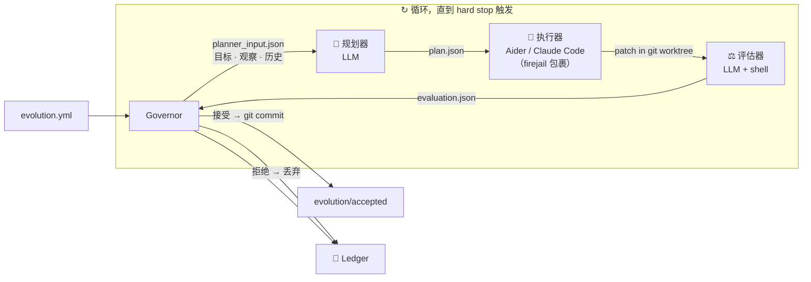

# Evolution Kernel

<p align="center">
  <strong>给一个 3 B-active 的开源小模型，用一晚上无人值守，把它在 SWE-bench Verified 上推到接近 GPT-5.5 的水平。</strong><br>
  <em>不重训，不微调，不动一个权重——只进化模型背后的 solver harness。</em>
</p>

<p align="center">
  <a href="README.md">English</a>
  ·
  <a href="docs/protocol.md">协议文档</a>
</p>

<p align="center">
  <a href="https://github.com/Protocol-zero-0/evolution-kernel/actions/workflows/tests.yml">
    
  </a>
  
  
  
  
</p>

---

## 动机

旗舰级 agent 能力是 *模型* 和 *运行它的 harness* 的联合产出——prompt 结构、工具循环、采样和 best-of-N、验证器、重试策略。今天这套 harness 在每家严肃的 AI 实验室都靠资深工程师手调，最终结果通常就是评判基座模型时实际的能力上限。

Evolution Kernel 把 harness 调优变成一个可复现的 runtime。把它指向一个目标 repo，给一个可衡量的目标，然后离开。回来看到的是：一条 git 分支记录所有被接受的改进、一份 ledger 记录每一个决策、以及——如果目标选得好——一个表现得像大模型的小模型。

具体兑现成什么：

- **推理成本塌缩。** 3 B-active 模型本地跑每任务几分钱；旗舰 API（GPT-5.5、Claude Opus 4.7）按美元计费。在 *不重训* 的前提下缩小能力差距，让一个 agent 栈从「规模化跑就烧钱」变成「规模化跑接近零边际成本」。
- **生产可靠性是机械的，不是口号。** 每个决策进 ledger，每个被接受的改动都是一个具名 git commit，每次实验跑在 git worktree 沙箱加 firejail OS 级沙箱里。整个 runtime 共 ~1,900 行，设计目标是放进生产，不是 demo。
- **Harness 是可移植资产。** 一旦给一个模型进化出好 harness，它能套用到同一参数级别的其它模型上。工作随模型迭代累积，而不是每次出新基座模型就丢掉重来。

---

## 它做什么

把 Evolution Kernel 指向任意 git 仓库，给它一个可衡量的目标，它就跑起一个闭环：

| 步骤 | 发生了什么 |
|:---:|---|
| 🔍 **观察** | 运行你的指标命令，或从 HTTP 接口拉取线上状态——当前胜率、延迟、eval 分数…… |
| 🧠 **规划** | LLM 读取指标 + 历史轮次记录，生成一个具体的改进方案 |
| 🔨 **执行** | Coding agent（Aider 或 Claude Code）在隔离的 git worktree 里实施方案，并由 firejail 包装 |
| ⚖️ **评估** | 重新运行指标；LLM 判断接受还是拒绝 |
| ✅ **提交 / 回滚** | 接受 → 在 `evolution/accepted` 上留下真实的 git commit。拒绝 → worktree 直接丢弃 |
| 🔁 **循环** | 重复，直到 `max_iterations`、`max_total_usd` 或 `max_total_tokens` 触发 |

每一次尝试都写入 **ledger**：目标、观察、方案、diff、评估、决策、反思。不依赖内存。任何外部审计者——或未来的你——都能从 ledger 单独复盘每一个决定。

---

## 当前能力（v1.0，已合入 `main`）

| 功能 | 状态 |
|---|:---:|
| 多轮 LLM 循环，带记忆（历史注入） | ✅ |
| 预算保护：`max_total_usd`、`max_total_tokens` | ✅ |
| 迭代次数 / 连续失败次数 hard stop | ✅ |
| 完整 ledger 审计链（进程重启后不丢失） | ✅ |
| git worktree 沙箱——每次尝试完全隔离 | ✅ |
| Scope 强制校验——`allowed_paths` 外的改动自动拒绝 | ✅ |
| 配置驱动：随时切换 LLM 提供商、模型、coding agent | ✅ |
| Aider 和 Claude Code 执行器适配 | ✅ |
| Anthropic 和 OpenAI 规划器 / 评估器适配 | ✅ |
| 目标评估器——当 mission 完成时自动停止 | ✅ |
| k 路并行探索（FunSearch / AlphaEvolve 模式） | ✅ |
| 进程级沙箱（firejail）——执行器无法写出 worktree 之外的任何文件 | ✅ |
| 远程观察者——HTTP 证据源，把线上 dashboard / eval endpoint 拉进 observation.json | ✅ |

**数字：** 99 个验收 / 单元测试 · CI Python 3.10 + 3.12 双版本绿 · 单依赖 PyYAML · 核心 runtime 约 1,900 行。

---

## v1.1 路线图目标

> 📋 **路线图目标 · 不是已落盘的运行。** 下面这个例子描述的是我们下一步要工程化达到的里程碑，不是已经 checked-in 的 artifact。当这个 run 落地后，完整 ledger 会提交到 [`evidence/`](evidence/) 目录，本 README 会链接过去。**今天就能复现**的真实运行，请参考 [`examples/sandbox_demo/`](examples/sandbox_demo/) 和 [`tests/`](tests/) 下的 99 个测试。

### 目标：让 Qwen3.6-35B-A3B（3 B active 参数，2026 年 4 月发布）在 SWE-bench Verified 上从 73.4% 跑到 ~85%——缩小到 GPT-5.5 的大部分差距，一晚上、无人值守、全程可审计。

```
                                  SWE-bench Verified（500 道真实 GitHub bug-fix · 2026 年 5 月）
  GPT-5.5                       ███████████████████████████████████░░  88.7%  ← OpenAI，2026-04-23
  Claude Opus 4.7               ██████████████████████████████████░░░  87.6%  ← Anthropic 当前 prod
  Gemini 3.1 Pro                ████████████████████████████████░░░░░  80.6%
  Kimi K2.6                     ████████████████████████████████░░░░░  80.2%
  ────────────────────────────────────────────────────────────────────────
  Qwen3.6-35B-A3B + 我们        ██████████████████████████████████░░░  ~85%   ← v1.1 目标
  Qwen3.6-35B-A3B（官方）       █████████████████████████████░░░░░░░░  73.4%  ← 公开 baseline
  ────────────────────────────────────────────────────────────────────────
  Gemma 4-31B（稠密）           ████████████████████░░░░░░░░░░░░░░░░░  52.0%
```

**为什么选这个 benchmark。** SWE-bench Verified 是 2026 年评估 coding agent 的事实标准——每家旗舰实验室发新版都报这个分。500 道真实 GitHub bug-fix 题，由人类标注者验证。它的任务和 Evolution Kernel 的本职 *完全对口*：拿到一份代码、提出一个改动、判断改动是否修好了 bug、决定接受 / 拒绝。

**为什么选这个模型。** [Qwen3.6-35B-A3B](https://qwen.ai/blog?id=qwen3.6-35b-a3b) 是阿里 2026-04-16 发布的开源旗舰（Apache 2.0）：35 B 总参 Mixture-of-Experts 架构，**每 token 只激活 3 B**。一张消费级 GPU 就能跑。3 B 激活参数足迹——比旗舰稠密模型**小约 30 倍**——在 SWE-bench Verified 上已经做到 73.4%，**距离 GPT-5.5 只差 15 分，而本地推理成本是每任务几分钱**。

**为什么这个差距可以闭合。** 那 73.4 % 本身已经是 Qwen 团队几个月人肉 harness 工程的产物。剩下到 GPT-5.5（88.7 %）的差距，是同类型的工程工作——更好的工具选择、并行采样、更紧的验证器循环、错误模式恢复——而这正是 Evolution Kernel 自动化掉的事。同一个模型，同一份权重，一份进化过的 harness。

**这个循环将做什么（按代展开）**（示意——这些是规划器在内部原型中历史上倾向于收敛到的 *那一类* 动作）：

```
模型：Qwen3.6-35B-A3B（权重冻结 · 3 B active 参数 · Apache 2.0）
基准：SWE-bench Verified · 500 道真实 GitHub bug-fix 任务
基线：73.4%   参考：GPT-5.5: 88.7%   Claude Opus 4.7: 87.6%

[gen 02] 规划 → "失败集中在多文件 refactor。先加 repo-map 工具，让执行器
                 在打 patch 前看到整个包结构。"
         执行 → aider 新增 harness/repo_map.py
         评估 → 77.2%  ▲+3.8 分 — 接受

[gen 05] 规划 → "剩余失败中 20% 是『patch 把相邻测试打挂』。先跑 pytest，
                 再生成只翻转失败测试的最小 patch。"
         执行 → aider 重写 harness/test_first_loop.py
         评估 → 79.6%  ▲+2.4 分 — 接受

[gen 09] 规划 → "硬 issue（多 hunk）还是会挂。并行采样 8 个候选 patch，
                 挑 verifier 分数最高的那个。"
         执行 → aider 新增 harness/best_of_n.py（并行）
         评估 → 82.4%  ▲+2.8 分 — 接受

[gen 14] 规划 → "Verifier 偶尔放过错 patch。提交前重新用 issue 的失败测试
                 跑一遍打过 patch 的代码，仍失败就拒。"
         执行 → aider 新增 harness/strict_verifier.py
         评估 → 84.3%  ▲+1.9 分 — 接受

[gen 19] 规划 → "把 best-of-8 和严格 verifier 组合成末端过滤。
                 丢掉廉价的单次兜底分支。"
         执行 → aider 整合两个组件
         评估 → ~85%  ▲+0.7 分 — 接受（距 GPT-5.5 仅 4 分）

[gen 25] STOP — 连续 4 代无显著改进

{"halted": true, "reason": "max_consecutive_failures reached (4)"}
```

```
最终：73.4% → ~85%   距 GPT-5.5 仅 4 分 · 距 Claude Opus 4.7 仅 3 分
      ~25 个 git commit · 全部落在 src/harness/
      激活参数：3 B（旗舰稠密 ~175 B+）
      模型权重：0 字节变化   Harness：~800 行 Python
      规划器/评估器 LLM 调用花费：目标 ≤ $80
      目标模型推理成本：~$0（单卡本地跑）
```

> **为什么这个 run 值得跑。** 如果它按目标落地，一个 3 B-active 的开源模型加上自动进化出的 harness，就闭合了到当今最大闭源旗舰的大部分差距——激活参数足迹只有三十分之一，推理成本几乎为零。进化后的 harness 可以转移到同一参数级别的其它模型上。

---

## Ledger：完整的审计链

```
ledger/
  .evolution_state.json       ← hard-stop 完整状态：迭代数、连续失败数、usd、tokens；进程重启后不丢失
  runs/
    0001/
      config.json             ← 你的 evolution.yml 完整快照
      observation.json        ← evidence_sources 命令的原始输出
      planner_input.json      ← 喂给规划器的目标 + 观察 + 历史
      plan.json               ← LLM 方案：摘要 · 步骤 · 预期改进
      executor_input.json     ← 喂给执行器的方案 + worktree 路径
      executor_output.json    ← 执行器结果
      evaluator_input.json    ← 喂给评估器的目标 + patch + 观察
      patch.diff              ← 执行器实际应用的 diff
      candidate_commit.txt    ← 沙箱 commit 的 git SHA
      evaluation.json         ← 评估结果 + 指标 + cost_usd + tokens_used
      decision.json           ← 接受 / 拒绝 + 原因
      reflection.json         ← 注入下一轮历史的一行摘要
    0002/  ...
  halted/
    20260501T120000Z.json     ← 任何 hard stop 触发时写入完整运行统计（迭代数、usd、tokens）
```

回滚一个 session 的所有变更：

```bash
git checkout evolution/accepted
git reset --hard <baseline-sha>   # 每次接受的变更都是一个具名 commit
```

---

## 架构



**Governor 故意设计得"笨"。** 它是纯编排逻辑——零 LLM 调用。所有智能都在三个角色脚本里。换掉任何一个角色，Governor 只关心它读写的 JSON 文件。

**角色之间通过文件通信，不共享内存。** 规划器不直接和执行器说话，评估器看不到执行器的自我评价。唯一的共享状态是 ledger。

---

## 快速上手

```bash
# 1. 安装
pip install evolution-kernel

# 2. 描述你的目标
cat > evolution.yml << 'EOF'
mission: "进化 harness，让 Qwen3.6-35B-A3B 在 SWE-bench Verified 上跑到 85%+"

evidence_sources:
  - type: shell
    command: "python3 scripts/run_swebench_verified.py --model qwen3.6-35b-a3b --json"

mutation_scope:
  allowed_paths: ["src/harness/"]

hard_stops:
  max_iterations: 30
  max_consecutive_failures: 4
  max_total_usd: 80.00

llm:
  provider: anthropic
  model: claude-sonnet-4-6
  api_key_env: ANTHROPIC_API_KEY

coding_agent:
  tool: aider

history:
  max_entries: 10

sandbox:
  enabled: true
  backend: firejail

roles:
  planner:   ["python3", "roles/planner.py"]
  executor:  ["bash",    "roles/executor.sh"]
  evaluator: ["python3", "roles/evaluator.py"]
EOF

# 3. 跑一晚上，放着不管
evolution-kernel --config evolution.yml --repo /path/to/project --ledger /tmp/ledger --loop
```

---

## 配置参考

> 所有路径（`scripts/run_swebench_verified.py`、`src/harness/`）指的是**你的目标项目**，不是本仓库。请替换成你自己的基准测试命令和源码目录。

```yaml
# 必填——"更好"对你的项目意味着什么
mission: "进化 harness，让 Qwen3.6-35B-A3B 在 SWE-bench Verified 上跑到 85%+"

# 如何衡量当前状态
evidence_sources:
  - type: shell         # stdout 写入 observation.json
    command: "python3 scripts/run_swebench_verified.py --model qwen3.6-35b-a3b --json"
  - type: file          # 文件内容写入 observation.json
    path: "metrics.json"
  - type: http          # GET 一个线上接口；status / headers / body 都进 observation
    url: "https://evals.example.com/run/latest"
    headers:
      Accept: application/json
    timeout: 10         # 秒（默认 10）

# 只有这些路径下的文件允许被修改
mutation_scope:
  allowed_paths:
    - "src/harness/"               # 不在列表里的改动自动拒绝

# 何时停止
hard_stops:
  max_iterations: 30            # 总轮数
  max_consecutive_failures: 4   # 连续拒绝多少次触发停止
  max_total_usd: 80.00          # 0 = 不限制
  max_total_tokens: 0           # 0 = 不限制

# 规划器和评估器使用的 LLM
llm:
  provider: anthropic           # anthropic | openai
  model: claude-sonnet-4-6
  api_key_env: ANTHROPIC_API_KEY

# 执行器使用的 coding agent
coding_agent:
  tool: aider                   # aider | claude-code

# 规划器每轮能看到多少轮历史
history:
  max_entries: 10

# 种群级搜索：每轮起 k 个独立 worktree，按 fitness 排名，最高分推进 evolution/accepted，
# 其余写入 ledger/failed/。k=1（默认）等价于单路 run_once。
parallel:
  k_branches: 1

# 进程级沙箱：开启后用 firejail 包装执行器命令——文件系统整体只读，仅 worktree
# 与该轮 ledger 子目录可写。规划器和评估器以读为主，不受影响。
sandbox:
  enabled: false                # 在装有 firejail 的机器上改为 true
  backend: firejail
  extra_args: []                # 追加到 firejail 命令的额外参数（在 `--` 之前）

roles:
  planner:   ["python3", "roles/planner.py"]
  executor:  ["bash",    "roles/executor.sh"]
  evaluator: ["python3", "roles/evaluator.py"]
```

**切换到 OpenAI：**
```yaml
llm:
  provider: openai
  model: gpt-5.5
  api_key_env: OPENAI_API_KEY
```

**切换到 Claude Code：**
```yaml
coding_agent:
  tool: claude-code
```

---

## CLI

```bash
# 循环跑直到 hard stop 触发（推荐）
evolution-kernel --config evolution.yml --repo /path/to/repo --ledger /tmp/ledger --loop

# 单轮
evolution-kernel --config evolution.yml --repo /path/to/repo --ledger /tmp/ledger

# 清空所有 hard-stop 状态（迭代数、失败数、预算），从头开始
evolution-kernel --ledger /tmp/ledger --reset
```

退出码：`0` 干净结束 · `3` 被 hard stop 中止。

---

## 安装

```bash
pip install evolution-kernel
```

从源码（唯一运行时依赖：PyYAML）：

```bash
git clone https://github.com/Protocol-zero-0/evolution-kernel.git
cd evolution-kernel
pip install -e .
```

需要 Python 3.10 或更高。

---

## 测试

```bash
python3 -m pytest tests/ -v
```

**99 个测试** · CI 全程无网络调用 · LLM 角色由轻量 fixture 脚本扮演 · CI 装 `firejail`，sandbox E2E 测试在真实 OS 级 mount 上跑。

---

## 写你自己的角色

每个角色是一个可执行文件，接收三个参数：

```
--input    <path>    governor 写给这个角色的 JSON
--output   <path>    角色退出前必须写入的 JSON
--worktree <path>    隔离 git 沙箱 checkout 的路径
```

`roles/planner.py`、`roles/executor.sh`、`roles/evaluator.py` 是参考实现。复制、改写、或者完全替换——shell 脚本、Docker 调用、任何能读 `--input` 写 `--output` 的东西都行。

---

## 已知局限

诚实交代 v1.0 *还不能* 做什么。

- **评估器是 LLM。** 可能被一个"看起来对但实际不对"的 patch 骗到，或者拒掉一个"对但写法陌生"的 patch。用 `goal_evaluator` + `evidence_sources` 里的强程序化门控把 LLM 判断锚定到 ground truth。
- **沙箱只管文件系统。** firejail 拦下 worktree 之外的写。它**不**拦网络、不拦 fork bomb、不拦进程注入。要跑不信任的执行器，外面再套 network namespace 或 VM。
- **历史是摘要，不是回放。** 规划器只看到最近 *N* 轮的一行 reflection，不看完整的过往 plan。长时程策略需要规划器把状态自己编码进 `plan.json` 的 summary。
- **成本会累积。** 30 轮循环用 Claude Sonnet 规划 + Claude Code 执行可能花 $40–$100。Hard-stop 预算是真的——设得比你预期还低。
- **真实 provider 集成不在 CI 上。** 99 个测试用 `tests/fixtures/` 的 fixture 脚本。端到端的 Aider / Claude Code / Anthropic / OpenAI 集成是每个 release 前手测，不是每次 push 都跑。

---

## 项目结构

```
evolution_kernel/   ~1,900 行 runtime（Governor · Observer · HardStops · Sandbox · Config · CLI · Scope）
roles/              参考规划器 / 执行器 / 评估器 / 目标评估器 / 策略师
examples/           demo 目标 + sandbox demo + 可直接运行的 evolution.yml
docs/               协议规范 + 第一个进化任务规范
tests/              99 个单元 + 验收测试 · 14 个 fixture 角色脚本
evidence/           checked-in 的可复现运行 artifact
```

---

## 许可证

MIT —— 见 [LICENSE](LICENSE)。
