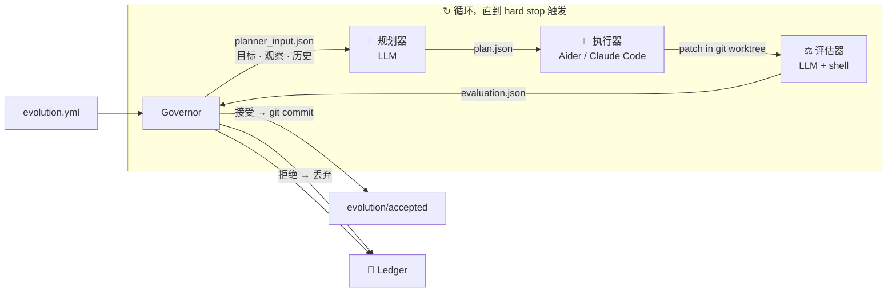

# Evolution Kernel

<p align="center">
  <strong>给 LLM 一个目标，让代码库自己进化，预算用完自动停。</strong>
</p>

<p align="center">
  约 1,200 行 Python 运行时，对任意代码库跑全自动多轮改进循环——<br>
  隔离在 git worktree 沙箱里，每一个决策留档，每一次变更可回滚。
</p>

<p align="center">
  <a href="README.md">English</a>
  ·
  <a href="docs/protocol.md">协议文档</a>
</p>

<p align="center">
  <a href="https://github.com/Protocol-zero-0/evolution-kernel/actions/workflows/tests.yml">
    
  </a>
  
  
  
  
</p>

---

<p align="center">
  <em>把它理解成 AlphaEvolve——但目标是你自己的代码仓库。</em><br>
  <em>你定义"更好"是什么意思，内核负责找到如何到达那里。</em>
</p>

---

## 它做什么

把 Evolution Kernel 指向任意 git 仓库，给它一个可衡量的目标，它就跑起一个闭环：

| 步骤 | 发生了什么 |
|:---:|---|
| 🔍 **观察** | 运行你的指标命令——采集当前状态（胜率、延迟、报错数……） |
| 🧠 **规划** | LLM 读取指标 + 历史轮次记录，生成一个具体的改进方案 |
| 🔨 **执行** | Coding agent（Aider 或 Claude Code）在隔离的 git worktree 里实施方案 |
| ⚖️ **评估** | 重新运行指标；LLM 判断接受还是拒绝 |
| ✅ **提交 / 回滚** | 接受 → 在 `evolution/accepted` 上留下真实的 git commit。拒绝 → worktree 直接丢弃 |
| 🔁 **循环** | 重复，直到 `max_iterations`、`max_total_usd` 或 `max_total_tokens` 触发 |

每一次尝试都写入 **ledger**：目标、观察、方案、diff、评估、决策。不依赖内存。任何外部审计者——或未来的你——都能从 ledger 单独复盘每一个决定。

---

## 快速上手

```bash
# 1. 安装
pip install evolution-kernel

# 2. 描述你的目标
cat > evolution.yml << 'EOF'
mission: "让游戏 AI 对内置对手的胜率达到 60% 以上"

evidence_sources:
  - type: shell
    command: "python3 scripts/tournament.py --games 20 --json"

mutation_scope:
  allowed_paths: ["ai/"]

hard_stops:
  max_iterations: 30
  max_consecutive_failures: 4
  max_total_usd: 3.00

llm:
  provider: anthropic
  model: claude-sonnet-4-6
  api_key_env: ANTHROPIC_API_KEY

coding_agent:
  tool: aider

roles:
  planner:   ["python3", "roles/planner.py"]
  executor:  ["bash",    "roles/executor.sh"]
  evaluator: ["python3", "roles/evaluator.py"]
EOF

# 3. 跑起来，放着不管
evolution-kernel --config evolution.yml --repo /path/to/game --ledger /tmp/ledger --loop
```

---

## 看它实际运行

### 游戏 AI 胜率从 35% 进化到 72%——隔夜完成，无人值守

```
进化前   ███░░░░░░░░░  35% 胜率   （20 局输 13 局）
进化后   ███████░░░░░  72% 胜率   （20 局赢 14 局）

共 9 轮 · 花费 $2.14 · 你的时间投入：0 分钟
```

循环逐轮发生的事情：

```
第 1 轮   观察: 胜率 35%
  规划    → "当前 AI 只会贪心取分，没有前瞻——加入 2 层 minimax 搜索"
  执行    → aider 重写 ai/strategy.py（改了 68 行）
  评估    → 胜率 51%  ▲+16 — 接受
  提交      a3f1c9e  "ai: 加入 minimax（35→51% 胜率）"

第 2 轮   观察: 胜率 51%
  规划    → "minimax 没处理残局——加入位置评估权重"
  执行    → aider 新增 ai/eval_weights.py
  评估    → 胜率 58%  ▲+7 — 接受
  提交      8b2de01  "ai: 位置权重（51→58%）"

第 3 轮   观察: 胜率 58%
  规划    → "加入 alpha-beta 剪枝以搜索更深"
  执行    → aider 修改 ai/strategy.py
  评估    → 胜率 56%  ▼-2 — 拒绝   连续失败次数: 1
  回滚      worktree 已丢弃 · 主分支没有任何变化

第 4 轮   观察: 胜率 58%  ← 历史记录显示第 3 轮 alpha-beta 失败
  规划    → "alpha-beta 导致了回退；改为根据失败模式分析调整残局权重"
  执行    → aider 调整 ai/eval_weights.py
  评估    → 胜率 67%  ▲+9 — 接受
  提交      2c9af44  "ai: 残局权重调优（58→67%）"

...

第 9 轮   观察: 胜率 72%
  评估    → 72%——目标 60% 已超越——接受
  提交      9d7b321  "ai: 最终调优（70→72%）"

{"halted": true, "reason": "max_iterations reached", "iterations": 30, "total_usd": 2.14, "total_tokens": 634000}
```

> **第 3 轮是关键。** alpha-beta 剪枝让结果变*更差*，系统拒绝了这次变更，代码库保持不动。第 4 轮展示了 LLM 读取了拒绝历史并换了思路。这就是"有记忆"在实际中的含义——不会把同样的错误答案猜两遍。

---

## Ledger：完整的审计链

```
ledger/
  .evolution_state.json       ← 预算计数器，进程重启后依然有效
  runs/
    0001/
      config.json             ← 你的 evolution.yml 完整快照
      observation.json        ← evidence_sources 命令的原始输出
      plan.json               ← LLM 方案：摘要 · 步骤 · 预期改进
      patch.diff              ← 执行器实际应用的 diff
      candidate_commit.txt    ← 沙箱 commit 的 git SHA
      evaluation.json         ← 评估结果 + 指标 + cost_usd + tokens_used
      decision.json           ← 接受 / 拒绝 + 原因
      reflection.json         ← 注入下一轮历史的一行摘要
    0002/  ...
  halted/
    20260501T120000Z.json     ← 任何 hard stop 触发时写入
```

回滚一个 session 的所有变更：

```bash
git checkout evolution/accepted
git reset --hard <baseline-sha>   # 每次接受的变更都是一个具名 commit
```

---

## 架构



**Governor 故意设计得"笨"。** 它是纯编排逻辑——零 LLM 调用。所有智能都在三个角色脚本里。换掉任何一个角色，Governor 只关心它读写的 JSON 文件。

**角色之间通过文件通信，不共享内存。** 规划器不直接和执行器说话，评估器看不到执行器的自我评价。唯一的共享状态是 ledger。

---

## 当前能力

| 功能 | 状态 |
|---|:---:|
| 多轮 LLM 循环，带记忆（历史注入） | ✅ |
| 预算保护：`max_total_usd`、`max_total_tokens` | ✅ |
| 迭代次数 / 连续失败次数 hard stop | ✅ |
| 完整 ledger 审计链（进程重启后不丢失） | ✅ |
| git worktree 沙箱——每次尝试完全隔离 | ✅ |
| Scope 强制校验——`allowed_paths` 外的改动自动拒绝 | ✅ |
| 配置驱动：随时切换 LLM 提供商、模型、coding agent | ✅ |
| Aider 和 Claude Code executor 支持 | ✅ |
| Anthropic 和 OpenAI 规划器 / 评估器支持 | ✅ |
| 目标评估器——当 mission 完成时自动停止 | 🔧 PR #5 |
| k 路并行探索（FunSearch / AlphaEvolve 模式） | 🔧 PR #6 |
| 进程级沙箱（firejail / bwrap），面向生产环境 | 🔧 PR #7 |

---

## 配置参考

```yaml
# 必填——"更好"对你的项目意味着什么
mission: "让游戏 AI 对内置对手的胜率达到 60% 以上"

# 如何衡量当前状态
evidence_sources:
  - type: shell         # stdout 写入 observation.json
    command: "python3 scripts/tournament.py --games 20 --json"
  - type: file          # 文件内容写入 observation.json
    path: "metrics.json"

# 只有这些路径下的文件允许被修改
mutation_scope:
  allowed_paths:
    - "ai/"             # 不在列表里的改动自动拒绝

# 何时停止
hard_stops:
  max_iterations: 30            # 总轮数
  max_consecutive_failures: 4   # 连续拒绝多少次触发停止
  max_total_usd: 3.00           # 0 = 不限制
  max_total_tokens: 0           # 0 = 不限制

# 规划器和评估器使用的 LLM
llm:
  provider: anthropic           # anthropic | openai
  model: claude-sonnet-4-6
  api_key_env: ANTHROPIC_API_KEY

# 执行器使用的 coding agent
coding_agent:
  tool: aider                   # aider | claude-code

# 规划器每轮能看到多少轮历史
history:
  max_entries: 10

roles:
  planner:   ["python3", "roles/planner.py"]
  executor:  ["bash",    "roles/executor.sh"]
  evaluator: ["python3", "roles/evaluator.py"]
```

**切换到 OpenAI：**
```yaml
llm:
  provider: openai
  model: gpt-4o
  api_key_env: OPENAI_API_KEY
```

**切换到 Claude Code：**
```yaml
coding_agent:
  tool: claude-code
```

---

## CLI

```bash
# 循环运行直到 hard stop 触发（推荐）
evolution-kernel --config evolution.yml --repo /path/to/repo --ledger /tmp/ledger --loop

# 只跑一轮
evolution-kernel --config evolution.yml --repo /path/to/repo --ledger /tmp/ledger

# 触发 halt 后重置预算计数器
evolution-kernel --ledger /tmp/ledger --reset
```

退出码：`0` 正常结束 · `3` 被 hard stop 触发

---

## 安装

```bash
pip install evolution-kernel
```

从源码安装（唯一运行时依赖：PyYAML）：

```bash
git clone https://github.com/Protocol-zero-0/evolution-kernel.git
cd evolution-kernel
pip install -e .
```

需要 Python 3.10 或更高版本。

---

## 运行测试

```bash
python3 -m pytest tests/ -v
```

39 个测试 · 不需要网络连接 · 角色脚本由轻量 fixture 替代。

---

## 自己写角色脚本

每个角色是一个普通的可执行程序，接收三个参数：

```
--input    <路径>    Governor 为这个角色准备的 JSON
--output   <路径>    角色退出前必须写入的 JSON
--worktree <路径>    隔离 git 沙箱的 checkout 路径
```

`roles/planner.py`、`roles/executor.sh`、`roles/evaluator.py` 是参考实现。复制并修改它们，或者完全替换成 shell 脚本、Docker 调用——任何能读 `--input`、写 `--output` 的东西都行。

---

## 项目结构

```
evolution_kernel/   约 1,200 行运行时（Governor · Observer · HardStops · Config · CLI）
roles/              参考版规划器、执行器、评估器
examples/           demo 目标仓库 + 可直接运行的 evolution.yml
docs/               协议文档
tests/              39 个单元 + 验收测试
```

---

## 许可证

MIT — 见 [LICENSE](LICENSE)。
