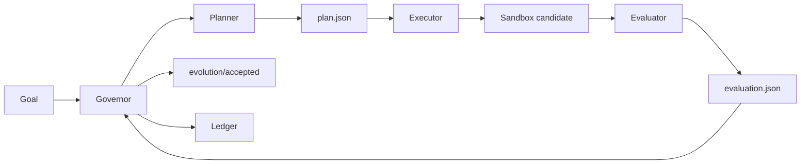

# Evolution Kernel

<p align="center">
  <strong>一个用于自主优化软件项目的通用进化引擎。</strong>
</p>

<p align="center">
  <a href="README.md">English</a>
  ·
  <a href="docs/protocol.md">协议</a>
  ·
  <a href="docs/token-ignition-first-task.md">首个优化对象</a>
</p>

<p align="center">
  
  = 3.10">
  
  
</p>

**Evolution Kernel** 是一个面向自主自我进化软件系统的最小协议与运行时。

它不是某个具体项目的自动化脚本，而是一个通用的进化内核。它的目标是让软件项目的持续改进过程变得**可控、可复现、可沙箱化、可审计、可回滚**。只要一个项目能够提供目标、沙箱和评估器，就可以成为它的优化对象。

## 快速开始

```bash
# 安装
pip install -e .

# 运行 Demo（使用 tests/fixtures/ 中的 fixture 角色）
bash examples/run_demo.sh

# 查看结果
cat /tmp/ek-demo-ledger/runs/0001/decision.json
```

## 为什么需要它

现代 coding agent 可以提出并修改代码，但长期的软件自我改进不只需要代码生成，还需要一个稳定的内核来管理整个进化闭环：

- 定义目标项目里的"改进"到底意味着什么；
- 在影响已接受分支之前隔离每一次实验；
- 用可复现的标准评估候选变更；
- 只晋升通过评估的候选结果；
- 记录每次实验发生了什么、为什么接受或拒绝。

Evolution Kernel 将这个闭环做成一个小而可检查的运行时。

## 进化闭环



## 首个优化对象

Evolution Kernel 的定位是优化**任何**软件项目。它第一个正在优化的项目是 **Token-Ignition**，具体对象是 Token-Ignition 的后端评估器。

因此，Token-Ignition 是第一个优化对象和参考适配器，不是 Evolution Kernel 的硬依赖。它用来验证这个内核能否安全、确定性地进化一个真实代码库，同时保持运行时足够小。

## 当前状态

当前 v0 版本已经实现了基础运行时：

| 模块 | 当前已实现 |
| --- | --- |
| Governor | 确定性编排 planning、execution、evaluation、promotion、rollback 和 ledger 更新。 |
| Sandbox | 基于 Git worktree 的实验隔离。候选变更只有被晋升后才会影响已接受分支。 |
| 角色交接 | `planner`、`executor`、`evaluator` 作为隔离命令运行，并通过 JSON 文件通信。 |
| 晋升模型 | 被接受的候选结果推进本地 `evolution/accepted` 分支；被拒绝的实验只保留记录，不推进该分支。 |
| 首个适配器 | Token-Ignition 适配器，包含用于评估器进化的手写 golden set。 |

## 目前还没有做什么

| 尚未完成 | 为什么重要 |
| --- | --- |
| LLM-native planner/executor | 当前测试使用 fixture 脚本；真实 agent 接入是下一步。 |
| 更强的进程/容器级沙箱 | Git worktree 能隔离文件，但 executor 和 evaluator 的运行隔离还应进一步增强。 |
| 多目标适配器框架 | Token-Ignition 是第一个目标；还需要更多适配器来证明通用性。 |
| 并行进化分支 | v0 目前聚焦单一 accepted 分支和简单晋升路径。 |

## Roadmap

- [ ] 增加 LLM 驱动的 planner 和 executor 实现。
- [ ] 为 executor 和 evaluator 增加更强的沙箱隔离。
- [ ] 将适配器接口从 Token-Ignition 推广为通用接口。
- [ ] 增加多个不同类型项目的 examples。
- [ ] 支持并行进化分支和更丰富的合并策略。
- [ ] 改进 ledger 历史、晋升决策、拒绝候选的报告能力。

## 文档

- [协议](docs/protocol.md)
- [Token-Ignition 首个任务](docs/token-ignition-first-task.md)

## 运行测试

```bash
python3 -m unittest discover -s tests -v
python3 adapters/token_ignition/evaluate_golden_cases.py
```

## CLI

```bash
# 使用配置文件（推荐）
python3 -m evolution_kernel.cli \
  --config examples/evolution.yml \
  --repo /path/to/target-repo \
  --ledger /tmp/evolution-ledger

# 旧式：显式指定角色参数（向后兼容）
python3 -m evolution_kernel.cli \
  --repo /path/to/target-repo \
  --ledger /tmp/evolution-ledger \
  --goal goal.json \
  --planner python3 my_planner.py \
  --executor python3 my_executor.py \
  --evaluator python3 my_evaluator.py

# 重置 hard stop 状态
python3 -m evolution_kernel.cli --reset --ledger /tmp/evolution-ledger
```

每个角色命令都会收到：

```text
--input <json>
--output <json>
--worktree <sandbox path>
```

## 配置格式（`evolution.yml`）

```yaml
mission: "Improve the project."

evidence_sources:
  - type: file
    path: "./metrics.json"
  - type: shell
    command: "bash ./scripts/status.sh"

mutation_scope:
  allowed_paths:
    - "src/"
    - "tests/"

hard_stops:
  max_iterations: 3
  max_consecutive_failures: 2

roles:
  planner:  ["python3", "my_planner.py"]
  executor: ["python3", "my_executor.py"]
  evaluator: ["python3", "my_evaluator.py"]
```

## Ledger 产物（每次运行）

每次运行会在 `ledger/runs/{run_id}/` 目录下生成以下文件：

| 文件 | 说明 |
|---|---|
| `observation.json` | 规划前收集的证据 |
| `plan.json` | Planner 的输出 |
| `patch.diff` | Executor 所做的变更 |
| `candidate_commit.txt` | 候选提交的 SHA |
| `evaluation.json` | Evaluator 的评估结论 |
| `decision.json` | 接受/拒绝决策及原因 |
| `reflection.json` | 用于审计的运行摘要 |
